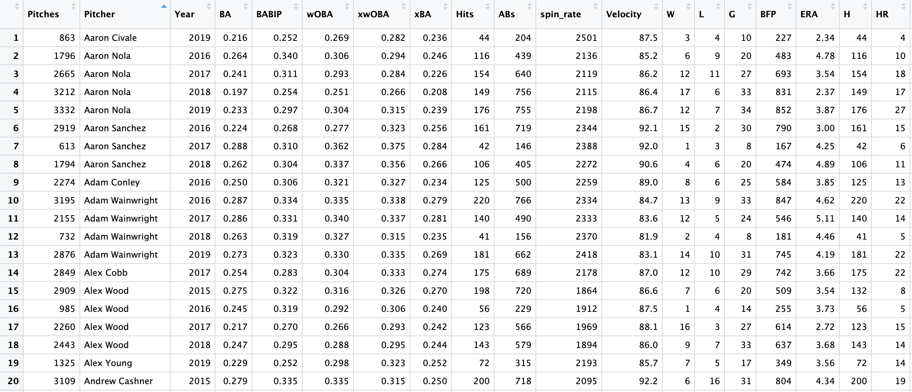

<style>
body {
text-align: justify}
</style>

<style>
p.caption {
  font-size: 0.8em;
}
</style>

```{r setup, include=FALSE}
knitr::opts_chunk$set(echo = TRUE,
                      fig.cap.style = "Image Caption",
                      fig.cap.pre = "Figure ",
                      fig.cap.sep = ": ")
library(tidyverse)
library(tidymodels)
library(rvest)
library(baseballr)
library(readr)
library(knitr)
library(kableExtra)
library(corrr)
library(gridExtra)
```

```{r echo=FALSE, message=FALSE, warning=FALSE, paged.print=FALSE}
Mega_Summary <- read_csv("Final Mega Summary.csv")
Original_Summary <- read_csv("Mega Summary.csv") %>%
  filter(`ERA (t+1)` < 7.00)

#Filter out Pre-arbitration
Mega_Summary_Filtered <- 
  Mega_Summary %>% 
  filter(salary_t1 > 600000)

#Filter out Pre-arbitration
Original_Summary_Filtered <- 
  Original_Summary %>% 
  filter(`Salary (t+1)` > 600000)

#Pitchers
pitchers0 <- read_csv("Final Mega Summary.csv")

pitchers <- pitchers0 %>%
  select(-ΔERA,- salary_t1, -ΔSalary)

pitchers_2019 <- pitchers0 %>%
  filter(Year == 2019) %>%
  arrange(desc(salary_t1)) %>%
  head(50) %>%
  select(Pitcher, Year, W, L, G, ERA, spin_rate, SO, BB, K_percent, 
         hard_hit_percent, barrel_percent, luck_adj_ERA, ERA_t1, salary_t1)

ensemble_preds <- read_csv("full_era_preds.csv")

ensemble_preds_2019 <- ensemble_preds %>%
  filter(Year == 2019) %>%
  select(Pitcher, .pred)

pitchers_2019 <- left_join(pitchers_2019, ensemble_preds_2019, by = "Pitcher")

pitchers <- left_join(pitchers, ensemble_preds, by = "Pitcher")

pitchers_2019 <- pitchers_2019 %>%
  mutate(`Standardized Forecasted Adjusted ERA` = -scale(.pred)) %>%
  mutate(`Standardized Salary` = scale(salary_t1)) %>%
  mutate(`Compensation` = (log((salary_t1))/(10 -.pred)))

pitchers_2019 <- pitchers_2019 %>%
  mutate(`Standardized Forecasted Adjusted ERA` = format(round(`Standardized Forecasted Adjusted ERA`, 2), nsmall = 2)) %>%
  mutate(`Standardized Salary` = format(round(`Standardized Salary`, 2), nsmall = 2))

pitchers_2019 <- pitchers_2019 %>%
  mutate(`Standardized Forecasted Adjusted ERA` = as.numeric(`Standardized Forecasted Adjusted ERA`)) %>%
  mutate(`Standardized Salary` = as.numeric(`Standardized Salary`))

pitchers_2019$ERA_type <- ifelse(pitchers_2019$`Standardized Forecasted Adjusted ERA` < 0, "below", "above")

pitchers_2019$salary_type <- ifelse(pitchers_2019$`Standardized Salary` < 0, "below", "above")

pitchers_2019_tidy <- pitchers_2019 %>%
  pivot_longer(cols = c(.pred, ERA_t1), 
               names_to = "type",
               values_to = "value")
```

```{r echo=FALSE, fig.height=3, fig.width=5, message=FALSE, warning=FALSE, fig.cap="**Figure 1.** Total team wins plotted against team ERA from 2006 onwards; trend line represents linear line of best fit. Correlation between the two values shown underneath."}
teams <- read_csv("teams.csv") %>%
  filter(yearID > 2006)

ggplot(teams, 
       aes(x = ERA, y = W)) +
  geom_point(alpha = 0.5, color = "midnightblue") +
  geom_smooth(method = lm,
              color = "midnightblue") +
  labs(x = "Team ERA",
       y = "Team Wins") +
  theme_classic()

cor(teams$ERA,
   teams$W)
```

<br>
<br>
<br>

```{r echo=FALSE, fig.height=3, fig.width=5, fig.cap="**Figure 2.** A sample of the complete pitching dataset. Each observational unit represents the season of an individual MLB pitcher between 2015 and 2019"}

```

<br>
<br>
<br>

```{r echo=FALSE, fig.height=3, fig.width=5, fig.cap="**Equation 1.** The full equation for Luck Adjusted ERA. Calculated by adding an aggregation of the most statistically significant luck adjustment metrics (as determined by their correlation with change in ERA) to ERA. The luck adjustment metrics are standardized and scaled, with the weight of the scale determined through manual fine-tuning"}

```

<br>
<br>
<br>

```{r echo=FALSE, fig.height=3, fig.width=10, message=FALSE, fig.cap="**Figure 3.** ERA over hard hit percentage and ERA over barrel percentage plotted against change in ERA; trend line represents linear line of best fit. Correlations shown underneath."}
plot1 <- Original_Summary %>%
  ggplot(aes(
    x = `ERA/Hard Hit %`,
    y = `ΔERA`)
    ) +
  geom_point(alpha = 0.5, color = "midnightblue") +
  geom_smooth(method = lm,
              color = "midnightblue") +
  theme_classic()

plot2 <- Original_Summary %>%
  filter(`ERA/Barrel %` < 1.5) %>%
  ggplot(aes(
    x = `ERA/Barrel %`,
    y = `ΔERA`)
    ) +
  geom_point(alpha = 0.5, color = "midnightblue") +
  geom_smooth(method = lm,
              color = "midnightblue") +
  theme_classic()

grid.arrange(plot1, plot2, ncol=2)
```

<br>
<br>
<br>

```{r echo=FALSE}
future_ERA_pred <- c(-0.178, -0.194, 0.219, 0.261, 0.284, 0.291, 0.333, 0.344, -0.346, -0.384)
labels2 <- c("Spin Rate", "W", "ERA", "Luck Adjusted ERA", "wOBA", "BA", "xwOBA", "xBA", "SO", "K %")
overall2<-data.frame(labels2, future_ERA_pred)
overall2<- overall2 %>% rename(
    `Predictor` = labels2,
    `Correlation with ERA (t+1)` = future_ERA_pred)
kbl(overall2, digits = 3, caption = "Strongest ERA Predictors") %>%
  kable_classic_2(bootstrap_options = "striped", font_size = 12, 
                full_width = FALSE)
```

**Table 1.** Summary of the ten predictors with the strongest correlation with future ERA, as determined by correlation coefficient

<br>
<br>
<br>

```{r echo=FALSE}
future_salary_pred <- c(0.165, 0.181, 0.211, 0.212, -0.213, -0.215, -0.226, 0.235, 0.256, 0.265)
labels3 <- c("BFP", "Spin Rate", "Pitches", "K %", "ERA", "BB %", "BA","ABs", "SO", "W")
overall3 <- data.frame(labels3, future_salary_pred)
overall3 <- overall3 %>% rename(
    `Predictor` = labels3,
    `Correlation with Salary (t+1)` = future_salary_pred)
kbl(overall3, digits = 3, caption = "Strongest Salary Predictors") %>%
  kable_classic(bootstrap_options = "striped", font_size = 12, 
                full_width = FALSE)
```

**Table 3.** Summary of the ten predictors with the strongest correlation with future salary, as determined by correlation coefficient.

<br>
<br>
<br>

```{r echo=FALSE, fig.height=6, fig.width=9, message=FALSE, warning=FALSE, fig.cap="**Figure 4.** Correlogram illustrating correlations between predictors."}
total_quant_pred <- 
  select_if(
    Original_Summary_Filtered,
    is.numeric
    )

total_quant_pred <- 
  total_quant_pred %>% 
  select(
    -Year,
    -ΔERA,-ΔSalary,
    -`Salary (t+1)`
         )

predictor_correlations <- 
  cor(total_quant_pred)

total_quant_pred %>%
  select(-`ERA/Hard Hit %`, -`xBA - BA`, -`xwOBA - wOBA`, -`ERA/Barrel %`, -`BABIP - Mean BABIP`) %>%
  correlate() %>%
  rearrange() %>%
  shave() %>%
  rplot(shape = 19, colours = c("midnightblue", "white", "darkorange")) +
  theme_classic() +
  theme(axis.text.x = element_text(angle = 45, hjust = 1))
  

```

<br>
<br>
<br>

```{r echo=FALSE, fig.height=3, fig.width=5, message=FALSE, fig.cap="**Figure 5.1.** Histogram of distribution of ERA."}
ggplot(Original_Summary, aes(x = `ERA (t+1)` ))+
  geom_histogram(
    color="grey100",
    fill = "midnightblue",
    bins = 30, 
    alpha = .75 ) +
  labs(y = "Count") +
  theme_classic()
```

<br>
<br>
<br>

```{r echo=FALSE, fig.height=3, fig.width=6, message=FALSE, fig.cap="**Figure 5.2.** Density plots of distribution of ERA, separated by year. Due to the inconsistencies and irregularities in team's preparation for the 2020 season (as a result of COVID-19), batters were abnormally disadvantaged at the beginning of the season. Subsequently, the mean future ERA for 2019 is lower than in the four previous years. Unfortunately, this is a difficult effect to mitigate in our data. However, as discussed in the methods section, we filtered the data as diligently as possible (in terms of sample size within individual pitchers' seasons) to ensure as robust a dataset as possible.)"}
ggplot(Original_Summary, aes(x = `ERA (t+1)`, fill = factor(Year))) +
  geom_density(alpha = 0.25) + 
  labs(y = "Density",
       fill = "Year") +
  theme_classic()
```

<br>
<br>
<br>

```{r echo=FALSE}
ERA_pred<-c(0.80821,1.267876,1.301881)
labels<-c("Ensemble Model","SIERA","PECOTA")
overall<-data.frame(labels, ERA_pred)
overall<- overall %>% rename(
    `Model` = labels,
    `MSE` = ERA_pred)
kbl(overall, digits = 3, caption = "Comparison with Previous Forecasts") %>%
  kable_classic_2(bootstrap_options = "striped", font_size = 12, full_width = FALSE)
```

**Table 2.** Summary of the predictive accuracies of relevant ERA forcasting models, as measured by mean squared error. Notably, the ensemble model handedly outperforms existing methods for predicting future ERA.

<br>
<br>
<br>

```{r echo=FALSE, fig.height=4, fig.width=6, message=FALSE, warning=FALSE, paged.print=FALSE, fig.cap="**Figure 6.1.** Ensemble model predictions plotted against future earned run average; trend line represents linear line of best fit. Correlation between the two values shown underneath."}
ggplot(ensemble_preds,
       aes(x = .pred, y = ERA_t1)) +
  geom_point(alpha = 0.5, color = "midnightblue") +
  geom_smooth(method = lm, color = "midnightblue") +
  labs(title =  "Predicted ERA vs. Actual ERA (2016-2020)",
       subtitle = "Model Predictions",
       x = "Predicted ERA (t+1)",
       y = "ERA (t+1)") + 
  theme_classic()

cor(ensemble_preds$.pred, ensemble_preds$ERA_t1)
```

<br>
<br>
<br>

```{r echo=FALSE, fig.width=10,fig.height=7, fig.cap="**Figure 6.2.** Dot plot illustrating the residuals of observed 2020 earned run average values among the 50 highest-paid starting pitchers."}
ggplot(pitchers_2019_tidy, aes(x = Pitcher,
                          y = value,
                          label = value)) + 
  geom_point(stat = 'identity',
             aes(color = type), 
             size = 2.5) +
  scale_color_manual(name = "Value", 
                    labels = c("Predicted ERA", "Actual ERA"), 
                    values = c(".pred" = "deepskyblue", 
                               "ERA_t1" = "palevioletred2")) +
  scale_x_discrete(guide = guide_axis(angle = 50)) +
  labs(title =  "Predicted ERA vs. Actual ERA (2020)",
       x = "Pitcher",
       y = "ERA Value") + 
  geom_line() +
  theme_minimal()
```

<br>
<br>
<br>

```{r, echo=FALSE, fig.width=9,fig.height=7, fig.cap="**Figure 6.3.** Horizontal bar graph illustrating the standardized 2020 earned run average predictions among the 50 highest-paid starting pitchers, arranged in descending order."}
ggplot(pitchers_2019, aes(x = reorder(Pitcher, `Standardized Forecasted Adjusted ERA`),
                          y = `Standardized Forecasted Adjusted ERA`,
                          label = `Standardized Forecasted Adjusted ERA`)) + 
  geom_bar(stat = 'identity', aes(fill = ERA_type), width = .5)  +
  scale_fill_manual(name = " ", 
                    labels = c("Above Average", "Below Average"), 
                    values = c("above"="deepskyblue", "below"="palevioletred2")) + 
  labs(title = "Diverging Standardized Forecasted ERA (2020)",
       x = "Pitcher",
       y = "Standardized ERA Forecast (Adjusted)") + 
  coord_flip() +
  theme_minimal()
```

<br>
<br>
<br>

```{r, echo=FALSE, fig.width=9,fig.height=7, fig.cap="**Figure 6.4.** Horizontal bar graph illustrating the observed standardized 2020 salary values among the 50 highest-paid starting pitchers, arranged in descending order."}
ggplot(pitchers_2019, aes(x = reorder(Pitcher, `Standardized Salary`),
                          y = `Standardized Salary`,
                          label = `Standardized Salary`)) + 
  geom_bar(stat = 'identity', aes(fill = salary_type), width = .5)  +
  scale_fill_manual(name = " ", 
                    labels = c("Above Average", "Below Average"), 
                    values = c("above"="deepskyblue", "below"="palevioletred2")) + 
  labs(title = "Diverging Standardized Salary (2020)",
       x = "Pitcher",
       y = "Standardized Salary") + 
  coord_flip() +
  theme_minimal()
```

<br>
<br>
<br>

```{r echo=FALSE, fig.height=8, fig.width=8, message=FALSE, warning=FALSE, paged.print=FALSE, fig.cap="**Figure 6.5.** Contour plot separating the 50 highest-paid starting pitchers in 2020 along both standardized salary and standardized predicted earned run average."}
ggplot() +
  scale_x_continuous(name = "Standardized Forecasted ERA (adjusted)",
                     breaks = seq(-3, 3, 1),
                     limits =c(-3, 3)) +
  scale_y_continuous(name = "Standardized Salary",
                     breaks = seq(-3, 3, 1),
                     limits =c(-3, 3)) +
  ggtitle("Standardized Forecasted ERA vs. Standardized Salary (2020)") +
  geom_rect(aes(xmin = 0, ymin = 0, xmax = 3, ymax = 3), 
            fill = "deepskyblue", alpha = 0.2) +
  geom_rect(aes(xmin = -3, ymin = -3, xmax = 0, ymax = 0), 
            fill = "palevioletred2", alpha = 0.2) +
  geom_density_2d(data = pitchers_2019, 
             aes(x = `Standardized Forecasted Adjusted ERA`, 
                 y = `Standardized Salary`),
             color = "dodgerblue2", alpha = 0.3) +
  geom_point(data = pitchers_2019, 
             aes(x = `Standardized Forecasted Adjusted ERA`, 
                 y = `Standardized Salary`),
             shape = 21,
             colour = "dodgerblue", 
             fill = "grey100", 
             size = 5) +
    geom_text(data = subset(pitchers_2019,
                          `Standardized Forecasted Adjusted ERA` < 1.7 & 
                          `Standardized Salary` > 1),
            aes(x = `Standardized Forecasted Adjusted ERA` , 
                y = `Standardized Salary`, 
                label = Pitcher),
            size = 3,
            alpha = 0.8,
            hjust = 0.44,
            vjust = -1.2) + 
        geom_text(data = subset(pitchers_2019,
                          `Standardized Forecasted Adjusted ERA` > 1 & 
                          `Standardized Salary` < 1),
            aes(x = `Standardized Forecasted Adjusted ERA` , 
                y = `Standardized Salary`, 
                label = Pitcher),
            size = 3,
            alpha = 0.8,
            hjust = 0.44,
            vjust = -1.2) + 
      geom_text(data = subset(pitchers_2019, 
                          `Standardized Forecasted Adjusted ERA` > 1.7),
            aes(x = `Standardized Forecasted Adjusted ERA` , 
                y = `Standardized Salary`, 
                label = Pitcher),
            size = 3,
            alpha = 0.8,
            hjust = 0,
            vjust = -1.2) +
  geom_text(data = subset(pitchers_2019, 
                          `Standardized Forecasted Adjusted ERA` < -1.5 & 
                          `Standardized Salary` < -0.75),
            aes(x = `Standardized Forecasted Adjusted ERA` , 
                y = `Standardized Salary`, 
                label = Pitcher),
            size = 3,
            alpha = 0.8,
            hjust = 0.44,
            vjust = -1) + 
  theme_minimal()
```

<br>
<br>
<br>

```{r echo=FALSE, fig.width=10,fig.height=7, fig.cap="**Figure 6.6.** Bar graph showing player compensation per unit of adjusted earned run average. Pitchers on the right of the graph are over-compensated for production relative to average, while those on the left are under-compensated."}
ggplot(pitchers_2019, aes(x = reorder(Pitcher, Compensation),
                          y = Compensation,
                          label = Compensation)) + 
  geom_col(aes(fill = Compensation)) +
  scale_fill_continuous(type = "viridis") +
  scale_x_discrete(guide = guide_axis(angle = 50)) +
  labs(title =  "Starting Pitcher Compensation (2020)",
       x = "Pitcher",
       y = "log(Salary) / (1 -Adjusted Forecasted ERA)") + 
  theme_minimal()
```


