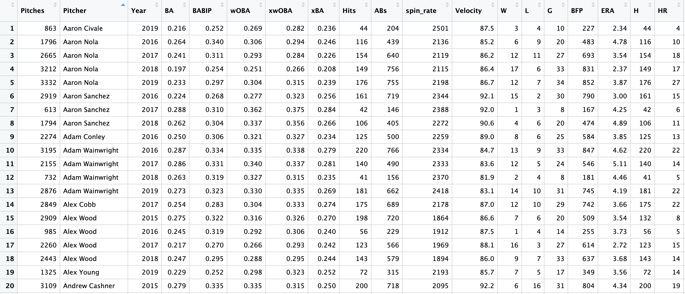

<style>
body {
text-align: justify}
</style>

<style>
p.caption {
  font-size: 0.8em;
}
</style>

```{r setup, include=FALSE}
knitr::opts_chunk$set(echo = TRUE,
                      fig.cap.style = "Image Caption",
                      fig.cap.pre = "Figure ",
                      fig.cap.sep = ": ")
library(tidyverse)
library(tidymodels)
library(rvest)
library(baseballr)
library(readr)
library(knitr)
library(kableExtra)
library(corrr)
```

## Abstract


The main goal for this project is to predict both future performance and salary for MLB pitchers from 2015-2019. This endeavor allows us to not only understand the metrics that underlie the two response variables, but also to investigate if a discrepancy exists between the predictors responsible for prospective pitching success and those responsible for a lucrative contract. Our salary data for 2017-2019 was scraped from spotrac.com and our salary data for 2015-2016 came from seanlahman.com. Additionally, all of our pitching statistics data came from the `statcast` tool from baseballsavant.com. After some preprocessing to clean up our data we ended up with a robust data set made up of 457 observations and 36 variables Our analysis and model building was all was done in RStudio and while we used quite a few advanced modeling techniques we also made use of our extensive domain knowledge to inform some of our decisions. Ultimately, comparison between a variety of model types revealed that an ensemble model performed the best in forecasting future ERA and salary, outperforming the existing null models. Additionally, inferential conclusions drawn from the more interpretable multiple linear regression models suggest that a discrepancy does exist between the contracts handed out by baseball front offices and future performance. While it seems like front offices are doing an adequate job of considering advanced statsitics, new, statcast measures that try to account for luck-adjustment have not yet been fully integrated into their decision making.

<br />
<br />

## Introduction

Since the sport’s inception in the nineteenth century, baseball has remained a fascination of statisticians and data scientists. More recently, the advent of Sabermetrics and ball tracking technology has propelled the mathematical study of baseball to new heights, with the ubiquity and accessibility of baseball metrics encouraging more and more professional baseball organizations to adopt an increasingly analytical approach.

A common refrain one hears from baseball fans is that general managers, those responsible for making personnel decisions such as trading a player or signing a free agent to a contract, are slow in adapting to the current trends in analytics. While some front offices, such as the Houston Astros (who boast a nine-man Sabermetric staff), have bought into an analytics-oriented approach, other teams have made their aversion to analytics clear. This disinclination is perhaps best encapsulated by the former Philadelphia Phillies GM Ruben Amaro claiming, back in 2014, that their team was "not a statistics-driven organization by any means". While such a sentiment seems outmoded now, the question remains over how earnestly baseball decision-makers have realistically accepted the growing Sabermetrics movement. 

To investigate this question, we decided to build a variety of models in order to attempt to predict a pitcher’s future contract using their statistics from the past season. The rationale behind this was that, while baseball GMs might profess a certain belief in analytics publicly, the contracts they hand out represent a more verifiable illustration of what they actually value. Fitting a model to predict future salary will help answer this question, as it will allow us to perform inference on the various coefficients or weights placed on different metrics---including both basic counting statistics and more advanced statistics. If baseball front offices have genuinely accepted Sabermetrics to the degree that they claim, then we would expect to see that advanced statistics such as expected weighted on-base average (xwOBA) or spin rate to be the strongest predictors of future salary. If, on the other hand, we find that basic counting statistics such as total pitches or total wins are the strongest predictors, it would suggest that baseball GMs are more enamored with counting statistics than they would like to admit.

The second half of our project involves fitting a variety of models to try to predict a pitcher’s earned run average (ERA) in the coming season using statistics from the current season. The motivation for this exploration is that we wished to determine if the advanced Sabermetric statistics are truly more useful in predicting future performance than basic statistics such as total strikeouts. ERA describes the average number of runs given up by a pitcher over nine innings, and was the chosen metric to act as a proxy for pitching outcome, as it exemplifies a wholistic representation of a pitcher’s performance. While by no means a novel insight, it is also worth noting that a team's ERA is highly correlated with a team's total wins, prompting general managers to construct pitching rotations that minimize ERA in order to win more games (further validating ERA as an appropriate proxy for overall pitcher performance).


```{r echo=FALSE, fig.height=3, fig.width=5, message=FALSE, warning=FALSE, fig.cap="**Figure 1.** Total team wins plotted against team ERA; trend line represents linear line of best fit. Correlation between the two values shown underneath."}
teams <- read_csv("teams.csv") %>%
  filter(yearID > 2006)

ggplot(teams, 
       aes(x = ERA, y = W)) +
  geom_point(alpha = 0.5, color = "midnightblue") +
  geom_smooth(method = lm,
              color = "midnightblue") +
  labs(x = "Team ERA",
       y = "Team Wins") +
  theme_classic()

cor(teams$ERA,
   teams$W)
```


The aims and methods of this exploration differ from previous investigations in that the application of statistical learning models allow for more complexity compared to the single-metric methods that have been used traditionally (such as predicting ERA in subsequent seasons solely as a function of current season's ERA). While front offices certainly have proprietary models predicting a suite of different outcomes, online, the two methods used for predicting future salary and ERA both rely on basic statistics. For ERA, a post on the baseball statistics website FanGraphs attempted to predict 2011 ERA using 2010 statistics and identified skilled-interactive earned run average (SIERA) as the best predictor of future ERA (1). While the formula behind SIERA is quite complex, its calculation does not utilize Sabermetrics analytics (which were introduced in the 2014 season) in its calculation and its variables are restricted to basic statistics such as total strikeouts and plate appearances. In terms of predicting salary, a commonly used method is to calculate contract value over wins above replacement (WAR) to get the “cost of a win in free agency” (2). The formula for a pitcher’s WAR is quite complex but still does not fully integrate Sabermetrics statistics. Additionally, this method presupposes a linear relationship, which is to say that a four-win player costs the same as two two-win players, an assumption that we can circumvent with certain models.

Ultimately, in this project, we aimed to predict both future performance and salary for MLB pitchers. This endeavor allows us to not only understand the metrics that underlie the two response variables, but also to investigate if a discrepancy exists between the predictors responsible for prospective pitching success and those responsible for a lucrative contract. 

<br />

(1) https://blogs.fangraphs.com/are-pitching-projections-better-than-era-estimators/
(2) https://blogs.fangraphs.com/the-cost-of-a-win-in-free-agency-in-2020/

<br />
<br />

## Methods

There were a number of data wrangling and processing strategies that were implemented in the construction of our final data set:

<br />

#### Pitching Statistics and Advanced Pitching Statistics

Much of our advanced pitching metric data came from Baseball Savant's Statcast, a searchable online database developed by Major League Baseball. Because of its recent initiation, most of the advanced pitching statistics have only been recorded by Statcast from 2015 onwards, so we were limited to the past five seasons when pulling this data. We made the decision to avoid pulling advanced data from the year 2020, both because of the unorthodox nature of a COVID-shortened season and the fact that one-year forward variables were frequently implemented as a response in our models (and 2021 data doesn't yet exist). Fortunately, the data from Statcast is easily accessible, as it is open source and readily downloadable.

<br />
    
#### Salary Data

Our salary data had to be obtained from two different sources, since our primary data source had a paywall for the year 2015 and our secondary data  source did not include salary data for any year past 2016. 

To start, we downloaded our 2015 salary data from Sean Lahman's baseball database. The Lahman salary data was easy to pull, as it was included as a dataframe in the `Lahman` R package. 

Conversely, in order to acquire data for the 2016 through 2020 seasons, we had to get a little more creative. Salary data for MLB pitchers from 2016 through 2020 is publicly available on the Sportrac website, but it is not readily downloadable as a csv. As a result, we had to use the `rvest` package to scrape the data from the HTML source code. We consistently confronted an issue where, when attempting to scrape the salary data for an entire season, `rvest` would only pull the first 100 observations to limit memory usage. To circumvent this problem, we created a vector of links where each link corresponded to the page of an individual MLB team for a specific year. We then wrote a function to pull the data from the HTML source code from that page. We then ran the function through a for loop where the index was the list of links to each team, eventually constructing our dataset by using the `rbind()` function to combine all of the individual team dataframes. We repeated this process for each season, subsequently combining the Sportrac salary data with our salary data from `lahman` to get each individual pitcher's annual salary from 2015 through 2020.

<br />

#### Combining Data Sets

Worth noting is that we only pulled salary data for starting pitchers, both because it was a more feasible task in regards to controlling sample size and because pitching statistics and salary data vary greatly between the two principal groups of pitcher type (starting pitchers and relief pitchers). Including relief pitchers in our data would have resulted in less consistent and insightful modeling outcomes, motivating our decision to exclude relief pitchers from our data. That being said, because our pitching statistics dataset contained obervations consisiting of all pitcher types, we were required to filter the data to only contain the starting pitchers present in our salary dataset, which were able to achieve by filtering on a combination of total games played and the number of batters faced per game (both of which varied substantially between the two pitcher classes). In order to minimize any joining mistakes, we used the function `make_clean_names()` from the `janitor` package to clean each pitcher's name before joining. Following the join, we included several filters (specifically to ensure a sufficient volume of batters faced) in order to drop outliers and make certain that our data was as robust as possible. Ultimately, the data wrangling process resulted in a handful of lost observations and an overall decrease in sample size, but we maintained a sizable enough dataset that we weren't too concerned about adverse variance, especially with the sizable anticipated improvement in bias.

When all was said and done, we ended up with a dataset of 457 observations and 36 variables, an excerpt of which is shared below. Each observational unit in our dataset represents the season of an individual MLB pitcher between 2015 and 2019. Importantly, certain pitchers appear multiple times in the dataset, as many players sustain careers spanning the entire time series comprised in our data. 

```{r echo=FALSE, eval=FALSE, message=FALSE, warning=FALSE}
data <- read_csv("Final Mega Summary.csv")

nrow(data)
ncol(data)
```

```{r echo=FALSE, fig.height=4, fig.width=6}

```

<br />

#### Creating New Variables

In addition to joining a variety of variables from different sources, we also used the `mutate()` function to create several variables of our own. We first added a new column that represented the salary for an individual pitcher in the succeeding year. This resulted in two unique variables: `Salary` and `Salary (t+1)`. We added a similar column for ERA, giving us `ERA` and `ERA (t+1)`. Next, we created a number of distinct variables with the intent of quantifying the amount of "luck" that a pitch might experience in a given season. First, we performed some simple arithmetic transformations to create the following variables, each attempting to reconcile some measure of mean expected outcome with a corresponding measure of mean actual outcome: `BABIP - Mean BABIP`, `xBA - BA`, `xwOBA - wOBA`, `ERA/Barrel %`, and `ERA/Hard Hit %`. We then standardized and aggregated the most statistically significant of these "luck" variables, creating a variable that we appropriately named `Standardized Luck`. After determining an appropriate scale, we added a fraction of `Standardized Luck` to `ERA` to create a measure of `Luck Adjusted ERA`, represented by the equation below:


$$
{Luck \ Adjusted \ ERA}_t = 
{ERA}_t + 
\frac{1}{3} \cdot 
\frac{-(\frac{{\frac{ERA}{Barrel \ \%}}_t - \frac{\sum_{i}^{n} \frac{ERA}{Barrel \ \%}_i}{n}}{{\sigma({\frac{ERA}{Barrel \ \%}}_j)}} ) - (\frac{{\frac{ERA}{Hard \ Hit \ \%}}_t - \frac{\sum_{i}^{n} \frac{ERA}{Hard \ Hit \ \%}_i}{n}}{\sigma({\frac{ERA}{Hard \ Hit \ \%}}_j)})}{2}
$$

where 

$\sigma({\frac{ERA}{Barrel \ \%}}_j) = \sqrt{\frac{\sum_{j}^{n}({\frac{ERA}{Barrel \ \%}}_t - \frac{\sum_{i}^{n} \frac{ERA}{Barrel \ \%}_i}{n})^2_j}{n}} \ \ $ and    $\  \ \sigma({\frac{ERA}{Hard \ Hit \ \%}}_j) = \sqrt{\frac{\sum_{j}^{n}({\frac{ERA}{Hard \ Hit \ \%}}_t - \frac{\sum_{i}^{n} \frac{ERA}{Hard \ Hit \ \%}_i}{n})^2_j}{n}}$

<br />

A more detailed discussion of the definition, concept, and implications of "luck" in pitching outcomes is included in our exploratory data analysis.

<br />
<br />

## Data Exploration

### Salary Data Exploration

For data exploration, we will explore the correlations and associations between pitching statistics from the 2016-2019 seasons in order to determine if performance in the past year can predict future salary.

A filter was applied to `Salary` to remove salaries lower than $600,000, or the cut-off for pre-arbitration salaries. These players are under team control and their contracts are artificially deflated. Because these players' low salaries do not reflect their true "market price", they are excluded.

<br />

```{r echo=FALSE, message=FALSE, warning=FALSE, paged.print=FALSE}
Mega_Summary <- read_csv("Final Mega Summary.csv")
Original_Summary <- read_csv("Mega Summary.csv") %>%
  filter(`ERA (t+1)` < 7.00)

#Filter out Pre-arbitration
Mega_Summary_Filtered <- 
  Mega_Summary %>% 
  filter(salary_t1 > 600000)

#Filter out Pre-arbitration
Original_Summary_Filtered <- 
  Original_Summary %>% 
  filter(`Salary (t+1)` > 600000)
```

#### Looking at Salary

We began by examining the structure of our first response variable: future salary (`Salary (t+1)`).


```{r echo=FALSE, fig.height=3, fig.width=5, fig.cap="**Figure 2.1.** Histogram of distribution of MLB starting pitcher salary; the evident right skew necessitated a log transformation."}
ggplot(Mega_Summary_Filtered, 
       aes(x = salary_t1)) + 
  geom_histogram(
    color = "grey100",
    fill = "midnightblue",
    bins = 30, 
    alpha = .75 
    ) + 
  labs(x = "Salary (t+1)",
       y = "Count") +
  theme_classic()
```


As we can see, future salary is quite right skewed. This is understandable, as certain superstar pitchers have salaries that are magnitudes greater than the average starting pitcher. We considered a log transformation to try to ameliorate this skew.


```{r echo=FALSE, fig.height=3, fig.width=5, fig.cap="**Figure 2.2.** Histogram of distribution of log-transformed MLB starting pitcher salary; the previously mentioned right skew is no longer as extreme."}
ggplot(Mega_Summary_Filtered, 
       aes(x = log(salary_t1))) + 
  geom_histogram(
    color = "grey100",
    fill = "midnightblue",
    bins = 30, 
    alpha = .75 
    ) + 
  labs(x = "log(Salary (t+1))",
       y = "Count") +
  theme_classic()
```


It would appear as though the log transformation greatly reduced the degree of the previously observed right skew. While a slight left skew may now exist, we will consider log-transforming salary in our models in order to circumvent this extreme right skew.

<br />

#### Basic Pitching Statistics

Total wins (`W`) and total losses (`L`) constitute the most basic pitching statistics, indicating nothing more than the possible discrete outcomes resulting from a pitcher's contribution to a game. Total number of pitches (`Pitches`) also represents a fairly rudimentary measure of pitching performance and durability. Additionally, raw, unadjusted ERA (or the average number of runs a pitcher allows in a game) is another predictor that one would expect to be associated with salary. Lastly, the number of earned runs (the unprocessed counting statistic used to calculate ERA) stands out as another basic predictor in determining future salary.

```{r echo=FALSE, fig.height=3, fig.width=5, message=FALSE, fig.cap="**Figure 3.1.** Total pitcher wins plotted against future salary; trend line represents linear line of best fit. Correlation between the two values shown underneath."}
#Total Wins
ggplot(Mega_Summary_Filtered,
       aes(
         x = W,
         y = `salary_t1`)
       ) +
  geom_point(alpha = 0.5, color = "midnightblue")+
  geom_smooth(method = lm,
              color = "midnightblue") +
  labs(x = "W",
       y = "Salary (t+1)") +
  theme_classic()

cor(Mega_Summary_Filtered$W,
   Mega_Summary_Filtered$salary_t1)
```

```{r echo=FALSE, fig.height=3, fig.width=5, message=FALSE, fig.cap="**Figure 3.2.** Total pitcher losses plotted against future salary; trend line represents linear line of best fit. Correlation between the two values shown underneath."}
#Total Losses
ggplot(Mega_Summary_Filtered,
       aes(
         x = L,
         y = `salary_t1`)
       ) +
  geom_point(alpha = 0.5, color = "midnightblue")+
  geom_smooth(method = lm,
              color = "midnightblue") +
  labs(x = "L",
       y = "Salary (t+1)") +
  theme_classic()

cor(Mega_Summary_Filtered$L,
   Mega_Summary_Filtered$salary_t1)
```

```{r echo=FALSE, fig.height=3, fig.width=5, message=FALSE, fig.cap="**Figure 3.3.** Total pitches plotted against future salary; trend line represents linear line of best fit. Correlation between the two values shown underneath."}
#Total Pitches
ggplot(Mega_Summary_Filtered, 
       aes(
         x = Pitches,
         y = `salary_t1`)
       ) +
  geom_point(alpha = 0.5, color = "midnightblue")+
  geom_smooth(method = lm,
              color = "midnightblue") +
  labs(x = "Pitches",
       y = "Salary (t+1)") +
  theme_classic()

cor(Mega_Summary_Filtered$Pitches,
   Mega_Summary_Filtered$salary_t1)

```


Unsurprisingly, total wins illustrates a moderate, positive correlation with future salary, while total losses shows virtually no relationship with future salary. This observed pattern makes sense, as a pitcher's total number of wins is a historically omnipresent and oft-cited measurement by casual and serious baseball fans alike. Despite the aforementioned factors beyond a pitcher's control, GMs are likely to accrue high praise by signing a "winning" pitcher, regardless of how much the pitcher contributed to the team's total wins.

Meanwhile total number of pitches exhibits a moderate, positive correlation with salary. As we will see later on, pitching statistics having to do with productivity or volume of pitches are often highly correlated with salary.


```{r echo=FALSE, fig.height=3, fig.width=5, message=FALSE, fig.cap="**Figure 3.4.** Pitcher winning percentage plotted against future salary; trend line represents linear line of best fit. Correlation between the two values shown underneath."}
#Win percent
Mega_Summary_Filtered <- 
  Mega_Summary_Filtered %>% 
  mutate(Win_Percent = W/(W+L)) %>% 
  drop_na()

ggplot(Mega_Summary_Filtered, 
       aes(
         x = Win_Percent,
         y = salary_t1)
       ) +
  geom_point(alpha = 0.5, color = "midnightblue")+
  geom_smooth(method = lm,
              color = "midnightblue") +
  labs(x = "Win %",
       y = "Salary (t+1)") +
  theme_classic()

cor(Mega_Summary_Filtered$Win_Percent,
   Mega_Summary_Filtered$salary_t1)

```


Strikingly, a pitcher's win percentage has a lower correlation with future salary than the total number of wins. While wins and losses are inherently flawed statistics, one would imagine that a higher win-loss ratio implies that a pitcher is contributing more directly to a team's success and thus deserves a higher salary. Rather, it seems like the total number of wins is the more important statistic in the eyes of GMs.


```{r echo=FALSE, fig.height=3, fig.width=5, message=FALSE, fig.cap="**Figure 3.5.** Total games played plotted against future salary; trend line represents linear line of best fit. Correlation between the two values shown underneath."}
#Games played
ggplot(Mega_Summary_Filtered, 
       aes(
         x = G,
         y = salary_t1)
       ) +
  geom_point(alpha = 0.5, color = "midnightblue")+
  geom_smooth(method = lm,
              color = "midnightblue") +
  labs(x = "G",
       y = "Salary (t+1)") +
  theme_classic()

cor(Mega_Summary_Filtered$G,
   Mega_Summary_Filtered$salary_t1)

```


Total games played (`G`) appears to possess a very weak positive relationship with future salary. This is understandable for two reasons, the first being that pitchers who make a lot of appearances are generally more skilled and therefore trusted to appear in more games by managers. Concurrently, highly skilled pitchers are paid well. Secondly, as we have seen throughout this exploration so far, an increase in volume-related statistics generally tends to result in a larger paycheck.


```{r echo=FALSE, fig.height=3, fig.width=5, message=FALSE, fig.cap="**Figure 3.6.** Earned run average plotted against future salary; trend line represents linear line of best fit. Correlation between the two values shown underneath."}
#Current ERA
ggplot(Mega_Summary_Filtered,
       aes(
         x = `ERA`,
         y = salary_t1)
       ) +
  geom_point(alpha = 0.5, color = "midnightblue")+
  geom_smooth(method = lm,
              color = "midnightblue") +
  labs(x = "ERA",
       y = "Salary (t+1)") +
  theme_classic()
cor(Mega_Summary_Filtered$ERA,
    Mega_Summary_Filtered$salary_t1)

```


While ERA does exhibit a negative correlation with future salary, the weakness of the relationship is surprising, as giving up fewer runs is an unequivocally positive outcome for pitchers. The comparison of the relationship between future salary and ERA and future salary and total wins is fascinating, as total wins appears to be more highly valued in the eyes of a GM (despite a pitcher only having a limited amount of control over their team's performance and subsequent game outcomes). In contrast, a pitcher's ERA is independent of his team's performance, but nonetheless has a weaker relationship than total wins. What this suggests is that GMs generally do not do a sufficient enough job of isolating an individual pitcher's abilities, and instead place too much weight on counting statistics (such as wins) that are more stochastic and susceptible to noise.

<br />

#### Season Totals and Percentages 

While season totals might have a murky relationship with future performance, it is undeniable that statistics such as strikeouts are quite flashy and can therefore lead to lucrative contracts. As a result, season totals might be strong predictors of next year's salary. We first examined total batters faced (`ABs`), total strikeouts (`SO`), total number of batters walked on balls (`BB`), total hits (`H`), and total home runs allowed (`HR`).


```{r echo=FALSE, fig.height=3, fig.width=5, message=FALSE, fig.cap="**Figure 4.1.** Total batters faced plotted against future salary; trend line represents linear line of best fit. Correlation between the two values shown underneath."}
#Total batters faced
ggplot(Mega_Summary_Filtered,
       aes(
         x = ABs,
         y = salary_t1)
       ) +
  geom_point(alpha = 0.5, color = "midnightblue")+
  geom_smooth(method = lm,
              color = "midnightblue") +
  labs(x = "ABs",
       y = "Salary (t+1)") +
  theme_classic()

cor(Mega_Summary_Filtered$ABs,
    Mega_Summary_Filtered$salary_t1)
```

```{r echo=FALSE, fig.height=3, fig.width=5, message=FALSE, fig.cap="**Figure 4.2.** Total strikeouts plotted against future salary; trend line represents linear line of best fit. Correlation between the two values shown underneath."}
#Total strikeouts
ggplot(Mega_Summary_Filtered,
       aes(
         x = SO,
         y = salary_t1)
       ) +
  geom_point(alpha = 0.5, color = "midnightblue")+
  geom_smooth(method = lm,
              color = "midnightblue") +
  labs(x = "SO",
       y = "Salary (t+1)") +
  theme_classic()

cor(Mega_Summary_Filtered$SO,
    Mega_Summary_Filtered$salary_t1)
```

```{r echo=FALSE, fig.height=3, fig.width=5, message=FALSE, fig.cap="**Figure 4.3.** Total batters walked on balls plotted against future salary; trend line represents linear line of best fit. Correlation between the two values shown underneath."}
#Total batters walked
ggplot(Mega_Summary_Filtered,
       aes(
         x = BB,
         y = salary_t1)
       ) +
  geom_point(alpha = 0.5, color = "midnightblue")+
  geom_smooth(method = lm,
              color = "midnightblue") +
  labs(x = "BB",
       y = "Salary (t+1)") +
  theme_classic()

cor(Mega_Summary_Filtered$BB,
    Mega_Summary_Filtered$salary_t1)
```

```{r echo=FALSE, fig.height=3, fig.width=5, message=FALSE, fig.cap="**Figure 4.4.** Total hits plotted against future salary; trend line represents linear line of best fit. Correlation between the two values shown underneath."}
#Total hits
ggplot(Mega_Summary_Filtered,
       aes(
         x = H,
         y = salary_t1)
       ) +
  geom_point(alpha = 0.5, color = "midnightblue")+
  geom_smooth(method = lm,
              color = "midnightblue") +
  labs(x = "H",
       y = "Salary (t+1)") +
  theme_classic()

cor(Mega_Summary_Filtered$H,
    Mega_Summary_Filtered$salary_t1)
```

```{r echo=FALSE, fig.height=3, fig.width=5, message=FALSE, fig.cap="**Figure 4.5.** Total home runs plotted against future salary; trend line represents linear line of best fit. Correlation between the two values shown underneath."}
#Total Home Runs
ggplot(Mega_Summary_Filtered,
       aes(
         x = HR,
         y = salary_t1)
       ) +
  geom_point(alpha = 0.5, color = "midnightblue")+
  geom_smooth(method = lm,
              color = "midnightblue") +
  labs(x = "HR",
       y = "Salary (t+1)") +
  theme_classic()

cor(Mega_Summary_Filtered$HR,
    Mega_Summary_Filtered$salary_t1)
```


As anticipated, season totals in general have a strong, positive correlation with salary, and, following a trend that we will see again in this exploration, pitching volume can often be more predictive of future salary than pitch quality. 

Total strikeouts and total batters faced have the strongest positive relationships with future salary. This is to be expected, as strikeouts are both the sign of a good pitcher and quite attractive to the average baseball fan. Similarly, a high number of batters faced suggests a well-regarded pitcher that is entrusted with such responsibilities. More unexpectedly, undesirable outcomes like hits and home runs display a medium positive relationship as well. This seemingly contradictory trend perhaps can be explained by the fact that only good pitchers are permitted (by their managers) to play enough games to surrender such a high volume hits and home runs, whereas less-accomplished pitchers would be given limited playing time. If this hypothesis is true, then batting average against (`BA`) should be negatively correlated, as `BA` is a measurement of what percentage of hitters record a hit against a certain pitcher.

Total number of batters walked on balls has a very weak (close to nonexistent) positive relationship with future salary. This is understandable, as number of batters walked can be more contingent on an individual's style of pitching rather than their quality as a pitcher. Less batters walked simply suggests better control, and superior control in a vacuum does not necessarily suggest a better pitcher.

Next we looked to see if the percent of strikeouts (`K %`), walks (`BB %`), and hits (`BA`) are correlated with future salary.


```{r, echo=FALSE, fig.height=3, fig.width=5, message=FALSE, fig.cap="**Figure 4.6.** Strikeout percentage plotted against future salary; trend line represents linear line of best fit. Correlation between the two values shown underneath."}
#Strikeout Percent
ggplot(Mega_Summary_Filtered,
       aes(
         x = K_percent,
         y = salary_t1)
       ) +
  geom_point(alpha = 0.5, color = "midnightblue")+
  geom_smooth(method = lm,
              color = "midnightblue") +
  labs(x = "K %",
       y = "Salary (t+1)") +
  theme_classic()

cor(Mega_Summary_Filtered$K_percent,
    Mega_Summary_Filtered$salary_t1)
```

```{r, echo=FALSE, fig.height=3, fig.width=5, message=FALSE, fig.cap="**Figure 4.7.** Walk percentage plotted against future salary; trend line represents linear line of best fit. Correlation between the two values shown underneath."}
#Percent of Batters walked
ggplot(Mega_Summary_Filtered,
       aes(
         x = BB_percent,
         y = salary_t1)
       ) +
  geom_point(alpha = 0.5, color = "midnightblue")+
  geom_smooth(method = lm,
              color = "midnightblue") +
  labs(x = "BB %",
       y = "Salary (t+1)") +
  theme_classic()

cor(Mega_Summary_Filtered$BB_percent,
    Mega_Summary_Filtered$salary_t1)
```

```{r, echo=FALSE, fig.height=3, fig.width=5, message=FALSE, fig.cap="**Figure 4.8.** Batting average plotted against future salary; trend line represents linear line of best fit. Correlation between the two values shown underneath."}
#Batting average against (hit percent)
ggplot(Mega_Summary_Filtered,
       aes(
         x = BA,
         y = salary_t1)
       ) +
  geom_point(alpha = 0.5, color = "midnightblue")+
  geom_smooth(method = lm,
              color = "midnightblue") +
  labs(x = "Batting Average (BA)",
       y = "Salary (t+1)") +
  theme_classic()

cor(Mega_Summary_Filtered$BA,
    Mega_Summary_Filtered$salary_t1)


```


Interestingly, even though strikeout percentage is still positively correlated with future salary, the strength of the relationship is not as strong as the raw number of strikeouts. Both the percentage of batters walked and batting average have a moderate to weak negative relationship with future salary. The negative correlation between future salary and BA is notable as, in conjunction with the previously-mentioned positive correlation between total hits and salary, it  supports the previous hypothesis that only good, highly-valued pitchers are allowed to accumulate a large number of hits. As simply giving up a lot of hits, resulting in a high total number of hits but also a high BA, is negatively correlated with future earning. Surprisingly, `BB %` has a stronger negative relationship than `BA`, despite total number of hits having a stronger correlation with future salary than total number of batters walked. The discrepancy between total batters walked and percentage of batters walked is not easily explained.

We next looked at some season percentages of more advanced statistics such as hard hit percentage (`Hard Hit %`) and barrel percentage (`Barrel %`). Both of these statistics look at the speed and angle of the ball after being hit by the batter. `Barrel %` represents batted balls with exit velocities and launch angles that, historically, have led to a minimum .500 batting average (or a 50% chance of resulting in a hit). `Hard Hit %` is similar to `Barrel %`, but does not consider launch angle and simply describes batted balls with exit velocities exceeding 95 MPH. Naively, one would expect a negative relationship, as a good pitcher should try to avoid giving up hard contact.


```{r, echo=FALSE, fig.height=3, fig.width=5, message=FALSE, fig.cap="**Figure 4.9.** Hard hit percentage plotted against future salary; trend line represents linear line of best fit. Correlation between the two values shown underneath."}
#Hard hit percent
ggplot(Mega_Summary_Filtered,
       aes(
         x = hard_hit_percent,
         y = salary_t1)
       ) +
  geom_point(alpha = 0.5, color = "midnightblue")+
  geom_smooth(method = lm,
              color = "midnightblue") +
  labs(x = "Hard Hit %",
       y = "Salary (t+1)") +
  theme_classic()

cor(Mega_Summary_Filtered$hard_hit_percent,
    Mega_Summary_Filtered$salary_t1)
```

```{r, echo=FALSE, fig.height=3, fig.width=5, message=FALSE, fig.cap="**Figure 4.10.** Barrel percentage plotted against future salary; trend line represents linear line of best fit. Correlation between the two values shown underneath."}
#Barrel percent
ggplot(Mega_Summary_Filtered,
       aes(
         x = barrel_percent,
         y = salary_t1)
       ) +
  geom_point(alpha = 0.5, color = "midnightblue") +
  geom_smooth(method = lm,
              color = "midnightblue") +
  labs(x = "Barrel %",
       y = "Salary (t+1)") +
  theme_classic()

cor(Mega_Summary_Filtered$barrel_percent,
    Mega_Summary_Filtered$salary_t1)
```


Considering how similar the two statistics are, the disparity between their strength of correlation is quite striking. Hard hit % is moderately negatively correlated with future salary while barrel % has essentially no correlation. This is surprising as the two are quite similar as well as correlated with each other.

<br />

#### Pitch Averages

Next, we examined if the averages of certain statistics were correlated with salary, specifically looking at average pitch speed (`Velocity`) and average spin rate (`Spin Rate`), measured in MPH and RPM respectively.


```{r, echo=FALSE, fig.height=3, fig.width=5, message=FALSE, fig.cap="**Figure 5.1.** Average pitch speed plotted against future salary; trend line represents linear line of best fit. Correlation between the two values shown underneath."}
#Average Speed
ggplot(Mega_Summary_Filtered,
       aes(
         x = Velocity,
         y = salary_t1)
       ) +
  geom_point(alpha = 0.5, color = "midnightblue") +
  geom_smooth(method = lm,
              color = "midnightblue") +
  labs(x = "Velocity",
       y = "Salary (t+1)") +
  theme_classic()

cor(Mega_Summary_Filtered$Velocity,
    Mega_Summary_Filtered$salary_t1)
```

```{r, echo=FALSE, fig.height=3, fig.width=5, message=FALSE, fig.cap="**Figure 5.2.** Average spin rate plotted against future salary; trend line represents linear line of best fit. Correlation between the two values shown underneath."}
#Average spin rate
ggplot(Mega_Summary_Filtered,
       aes(spin_rate,
         y = salary_t1)
       ) +
  geom_point(alpha = 0.5, color = "midnightblue") +
  geom_smooth(method = lm,
              color = "midnightblue") +
  labs(x = "Spin Rate",
       y = "Salary (t+1)") +
  theme_classic()

cor(Mega_Summary_Filtered$spin_rate,
    Mega_Summary_Filtered$salary_t1)

```


Naively, one might expect faster pitches to be harder to hit and thus expect pitchers with higher average velocities to be handsomely paid. However, the negative correlation, albeit with a very weak association, suggests that average pitch speed is actually inversely related to salary. There are a couple of reasons why this might be. The most obvious is that pitchers who lack speed often make up for it with stellar control or a wide arsenal of off-speed pitches. Another reason is that, instinctively, average pitch speed might be correlated with certain negative predictors like home runs, as batters can often make hard contact against fast but poorly-placed pitches.

Spin rate is a topic that has garnered increased attention in the baseball community, and is something that pitchers place a lot of emphasis on, with many devoting substantial time and energy to improving the movement on breaking pitches. It seems that this interest is not misplaced, as there is a moderate positive relationship between spin rate and future salary.

<br />

#### Advanced Statistics

The correlations between future salary and advanced statistics was a point of focus for us as it offers the first indications as to whether front offices are successfully integrating analytics. The metrics we considered were weighted on-base average (`wOBA`), batting average on balls in play (`BABIP`), expected weighted on-base average (`xwOBA`), and expected batting average (`xBA`). The two expected statistics are notable, as they try to remove some of the noise (or "luck") from the statistic by calculating `wOBA` and `BA` based on the historical `wOBA` and `BA` of batted balls with similar exit velocities and launch angles. 


```{r, echo=FALSE, fig.height=3, fig.width=5, message=FALSE, fig.cap="**Figure 6.1.** Weighted on-base average plotted against future salary; trend line represents linear line of best fit. Correlation between the two values shown underneath."}
#Weighted on base average (wOBA)
ggplot(Mega_Summary_Filtered,
       aes(
         x = wOBA,
         y = salary_t1)
       ) +
  geom_point(alpha = 0.5, color = "midnightblue") +
  geom_smooth(method = lm,
              color = "midnightblue") +
  labs(x = "wOBA",
       y = "Salary (t+1)") +
  theme_classic()

cor(Mega_Summary_Filtered$wOBA,
   Mega_Summary_Filtered$salary_t1)
```

```{r, echo=FALSE, fig.height=3, fig.width=5, message=FALSE, fig.cap="**Figure 6.2.** Batting average on balls in play plotted against future salary; trend line represents linear line of best fit. Correlation between the two values shown underneath."}
#Batting average on balls in play against (BABIP)
ggplot(Mega_Summary_Filtered,
       aes(
         x = BABIP,
         y = salary_t1)
       ) +
  geom_point(alpha = 0.5, color = "midnightblue") +
  geom_smooth(method = lm,
              color = "midnightblue") +
  labs(x = "BABIP",
       y = "Salary (t+1)") +
  theme_classic()

cor(Mega_Summary_Filtered$BABIP,
   Mega_Summary_Filtered$salary_t1)
```

```{r, echo=FALSE, fig.height=3, fig.width=5, message=FALSE, fig.cap="**Figure 6.3.** Expected batting average on balls in play plotted against future salary; trend line represents linear line of best fit. Correlation between the two values shown underneath."}
#Expected wOBA
ggplot(Mega_Summary_Filtered,
       aes(
         x = xwOBA,
         y = salary_t1)
       ) +
  geom_point(alpha = 0.5, color = "midnightblue") +
  geom_smooth(method = lm,
              color = "midnightblue") +
  labs(x = "xwOBA",
       y = "Salary (t+1)") +
  theme_classic()

cor(Mega_Summary_Filtered$xwOBA,
   Mega_Summary_Filtered$salary_t1)
```

```{r, echo=FALSE, fig.height=3, fig.width=5, message=FALSE, fig.cap="**Figure 6.4.** Expected batting average plotted against future salary; trend line represents linear line of best fit. Correlation between the two values shown underneath."}
#Expected batting average
ggplot(Mega_Summary_Filtered,
       aes(
         x = xBA,
         y = salary_t1)
       ) +
  geom_point(alpha = 0.5, color = "midnightblue") +
  geom_smooth(method = lm,
              color = "midnightblue") +
  labs(x = "xBA",
       y = "Salary (t+1)") +
  theme_classic()

cor(Mega_Summary_Filtered$xBA,
   Mega_Summary_Filtered$salary_t1)

```


Interestingly, all four advanced statistics had negative correlations, albeit only moderate ones ones. This suggests that GMs perhaps are not as averse to advanced statistics as one would expect. The negative relationship is understandable, as these statistics measure the offensive production against the pitcher, thus, smaller values are desirable. Both `wOBA` and `BABIP` have stronger relationships with future salary than expected `wOBA` and `xBA`, which suggests that GMs are still not adequately separating out noise or luck. 

<br />

#### Luck Reversion

The concept of luck reversion will be discussed in more detail later in the exploration, as it generally pertains more to ERA than salary. That being said, the idea behind luck reversion is that, over the course of a single-season, pitchers may outperform expected outcome due to randomness alone. As discussed in our methods section, we attempted to quantify pitcher luck by transforming a handful of variables. The first two (`xwOBA-wOBA` and `xBA-BA`) are simply the difference between expected and observed statistics. The second two (`ERA/Hard Hit %` and `ERA/Barrel %`) operate under the assumption that hard contact (high values of `Hard Hit %` and `Barrel %`) will result in more earned runs and a higher earned run average, and if a pitcher's `ERA/Barrel %` is low, then that means that they were lucky in terms of having a lower earned run average than their pitching truly warrants.


```{r, echo=FALSE, fig.height=3, fig.width=5, message=FALSE, fig.cap="**Figure 7.1.** Expected weighted on-base average minus weighted on-base average plotted against future salary; trend line represents linear line of best fit. Correlation between the two values shown underneath."}
#xwOBA-wOBA
ggplot(Original_Summary_Filtered,
       aes(
         x = `xwOBA - wOBA`,
         y = `Salary (t+1)`)
       ) +
  geom_point(alpha = 0.5, color = "midnightblue") +
  geom_smooth(method = lm,
              color = "midnightblue") +
  theme_classic()

cor(Original_Summary_Filtered$`xwOBA - wOBA`,
   Original_Summary_Filtered$`Salary (t+1)`)
```

```{r, echo=FALSE, fig.height=3, fig.width=5, message=FALSE, fig.cap="**Figure 7.2.** Expected batting average minus batting average plotted against future salary; trend line represents linear line of best fit. Correlation between the two values shown underneath."}
#xBA-BA
ggplot(Original_Summary_Filtered,
       aes(
         x = `xBA - BA`,
         y = `Salary (t+1)`)
       ) +
  geom_point(alpha = 0.5, color = "midnightblue") +
  geom_smooth(method = lm,
              color = "midnightblue") +
  theme_classic()

cor(Original_Summary_Filtered$`xBA - BA`,
   Original_Summary_Filtered$`Salary (t+1)`)
```

```{r, echo=FALSE, fig.height=3, fig.width=5, message=FALSE, fig.cap="**Figure 7.3.** Earned run average over hard hit percentage plotted against future salary; trend line represents linear line of best fit. Correlation between the two values shown underneath."}
#ERA/Hard Hit
ggplot(Original_Summary_Filtered,
       aes(
         x = `ERA/Hard Hit %`,
         y = `Salary (t+1)`)
       ) +
  geom_point(alpha = 0.5, color = "midnightblue") +
  geom_smooth(method = lm,
              color = "midnightblue") +
  theme_classic()

cor(Original_Summary_Filtered$`ERA/Hard Hit %`,
   Original_Summary_Filtered$`Salary (t+1)`)
```

```{r, echo=FALSE, fig.height=3, fig.width=5, message=FALSE, fig.cap="**Figure 7.4.** Earned run average over barrel percentage plotted against future salary; trend line represents linear line of best fit. Correlation between the two values shown underneath."}
#ERA/Barrel
ggplot(Original_Summary_Filtered %>% filter(`ERA/Barrel %` < 1.5),
       aes(
         x = `ERA/Barrel %`,
         y = `Salary (t+1)`)
       ) +
  geom_point(alpha = 0.5, color = "midnightblue") +
  geom_smooth(method = lm,
              color = "midnightblue") +
  theme_classic()

cor(Original_Summary_Filtered$`ERA/Barrel %`,
   Original_Summary_Filtered$`Salary (t+1)`)

```


While `xwOBA-wOBA` doesn't display any strong relationship with future salary, `xBA-BA` had a moderately strong positive relationship, which suggests that lucky players with a lower `BA` than expected are getting paid more in succesive seaons. This further suggests that GMs really have trouble separating out luck. This trend is further exemplified with `ERA/Hard Hit %` or `ERA/Barrel %`, as those with smaller values (luckier pitchers) tend to have higher salaries, as suggested by the positive relationship. This relationship is especially pertinent with `ERA/Barrel %`, which has a sizable correlation coefficient. Overall, it seems like while GMs are attuned to advanced statistics, they have not yet fully bought into luck adjusted statistics.

<br />

#### Correlations Between Predictors

```{r echo=FALSE, fig.height=6, fig.width=9, message=FALSE, warning=FALSE, fig.cap="**Figure 8.1.** Correlogram illustrating correlations between predictors."}
total_quant_pred <- 
  select_if(
    Original_Summary_Filtered,
    is.numeric
    )

total_quant_pred <- 
  total_quant_pred %>% 
  select(
    -Year,
    -ΔERA,-ΔSalary,
    -`Salary (t+1)`
         )

predictor_correlations <- 
  cor(total_quant_pred)

total_quant_pred %>%
  select(-`ERA/Hard Hit %`, -`xBA - BA`, -`xwOBA - wOBA`, -`ERA/Barrel %`, -`BABIP - Mean BABIP`) %>%
  correlate() %>%
  rearrange() %>%
  shave() %>%
  rplot(shape = 19, colours = c("midnightblue", "white", "darkorange")) +
  theme_classic() +
  theme(axis.text.x = element_text(angle = 45, hjust = 1))
  

```


This correlation plot is a great way to quickly investigate how some of the predictors are correlated. Immediately, we can distinguish a fairly pronounced degree collinearity, and although we won't discuss each instance, some salient trends certainly stand out.


```{r echo=FALSE}
volume_predictors<-Mega_Summary_Filtered %>%select(Pitches,W,L,BFP,H,HR,SO)
volume_predictors_cor<-cor(volume_predictors)
kable(volume_predictors_cor, digits = 3, caption = "Volume Predictor Correlations") %>%
  kable_styling(bootstrap_options = "striped", font_size = 12, full_width = FALSE)
```


First of all, the "volume" predictors related to sheer number of pitches and games played are all very highly correlated to each other. Specifically, total pitches, total batters faced, total games, total hits, total strikeouts, total wins, total losses, total home runs all have high R values with each other. These are also some of the stronger predictors in predicting salary. In the interest of avoiding collinearity, we might want to combine these variables.


```{r echo=FALSE}
hit_predictors<-Original_Summary_Filtered %>%select(BA,xBA,`K %`)
hit_predictors_cor<-cor(hit_predictors,Original_Summary_Filtered$`Spin Rate`)
kable(hit_predictors_cor, digits = 3, caption = "Spin Rate Correlations") %>%
  kable_styling(bootstrap_options = "striped", font_size = 12, full_width = FALSE)
```


Fascinatingly, spin rate is positively correlated with strikeout percentage and negatively correlated with `BA`. So baseball pundits might be on to something in promoting this statistic, since increasing strikes and reducing hits is a positive outcome.


```{r echo=FALSE}
barrel_predictors<-Original_Summary_Filtered %>%select(xBA,wOBA,xwOBA,ERA)
barrel_predictors_cor<-cor(barrel_predictors,Original_Summary_Filtered$`Barrel %`)
kable(barrel_predictors_cor, digits = 3, caption = "Barrel % Correlations") %>%
  kable_styling(bootstrap_options = "striped", font_size = 12, full_width = FALSE)
```


Average barrel percentage has a medium positive correlation with our advanced statistics `wOBA` as well as `xwOBA` and `xBA`. It is also positively correlated with ERA. This makes sense as harder contact means more runs allowed which means more offense, thus raising the values of the advanced statistics.


```{r echo=FALSE}
offense_statistics<-Original_Summary_Filtered %>%select(`K %`,BA,wOBA,xwOBA)
strikes_and_hits<-Original_Summary_Filtered %>%select(`K %`,BA)
strikes_hits_statistics_cor<-cor(offense_statistics,strikes_and_hits)
kable(strikes_hits_statistics_cor, digits = 3, caption = "Rate Metric Correlations") %>%
  kable_styling(bootstrap_options = "striped", font_size = 12, full_width = FALSE)
```


Strikeout percentage and `BA` were negatively correlated with each other, which is reasonable since the two measures are mutually exclusive. `K %` also had high, negative correlations with the `wOBA` and `xWOBA` statistics, while `BA` had a high positive correlation with those two statistics. This is understandable, as those statistics try to quantify total offensive output, which consists of accumulating hits while avoiding strikeouts.


```{r echo=FALSE}
advanced_statistics<-Mega_Summary_Filtered %>%select(BABIP,xBA,wOBA,xwOBA)
advanced_statistics_cor<-cor(advanced_statistics,Mega_Summary_Filtered$ERA)
kable(advanced_statistics_cor, digits = 3, caption = "ERA Correlations") %>%
  kable_styling(bootstrap_options = "striped", font_size = 12, full_width = FALSE)
```


Our advanced statistics, `BABIP`, `wOBA`, `xwOBA`, and `xBA`, are all quite positively correlated with ERA. Given that the statistics all try to quantify offense and that ERA represents total offensive runs allowed, this relationship is to be expected. 


```{r echo=FALSE}
wins_and_lossess<-Mega_Summary_Filtered %>%select(W,L)
wins_and_lossess_cor<-cor(wins_and_lossess,Mega_Summary_Filtered$ERA)
kable(wins_and_lossess_cor, digits = 3, caption = "ERA Correlations") %>%
  kable_styling(bootstrap_options = "striped", font_size = 12, full_width = FALSE)
```


An additional, interesting, observation is that ERA is positively correlated with number of losses with a medium degree of positive correlation , while the inverse relationship between ERA and number of wins is stronger. This suggests that while a poor pitcher with a high ERA can easily lose games,  a skilled pitcher with a low ERA can perhaps contribute more to a winning effort.

<br />
<br />

### ERA Data Exploration

Having explored possible predictors of salary (comparing both simple and complex variables), we move on to our prediction of future earned run average (ERA). In this case, our selected response (ERA) can be thought of as a rough proxy for general pitching performance and outcome. Since the inception of the statistic in the early 1900s, ERA has been the most ubiquitous and cited measure of pitcher effectiveness, as it represents a straightforward calculation of the average amount of runs a pitcher allows over the duration of typical game (with run prevention thought of as the ultimate aim of pitching). Despite ERA being the most functional measure of pitching performance, it is nonetheless subject to a significant deal of random noise between individual pitchers' seasons. The development of advanced pitching analytics therefore may lend itself to more accurate forecasts of future ERA than simple counting statistics (such as wins, strikeouts, and pitches). With this in mind, we are motivated to find the statistical model that most accurately predicts ERA in a successive season given a number of predictors generated from data in the current season. This should allow us to assess and predict player performance not based on actual (occasionally random) outcomes, but rather on an aggregation of predicted outcomes determined by a set of relevant statistical parameters. Ultimately, this model should lend itself to making informed salary decisions by MLB general managers.


```{r echo=FALSE, message=FALSE, warning=FALSE, paged.print=FALSE}
pitch_data <- read_csv("2020_summary.csv") %>%
  rename(`Pitch Category` = pitch_category) %>%
  rename(wOBA = wOBAA)
```

```{r echo=FALSE, fig.height=3, fig.width=5, message=FALSE, fig.cap="**Figure 9.1.** Average pitch speed plotted against weighted on-base average; trend line represents linear line of best fit. Correlation between the two values shown underneath."}
pitch_data  %>%
  ggplot(aes(
    x = `Average Pitch Speed`,
    y = wOBA)
    ) +
    geom_point(alpha = 0.5, color = "midnightblue") +
  geom_smooth(method = lm,
              color = "midnightblue") +
  labs(x = "Velocity") +
  theme_classic()
```

```{r echo=FALSE}
cor(pitch_data$`Average Pitch Speed`, pitch_data$wOBA)
```

```{r echo=FALSE, fig.height=3, fig.width=6, message=FALSE, fig.cap="**Figure 9.2.** Average pitch speed plotted against weighted on-base average, seperated by pitch category; trend line represents linear line of best fit. Correlation between the two values shown underneath."}
pitch_data  %>%
  ggplot(aes(
    x = `Average Pitch Speed`,
    y = wOBA, color =`Pitch Category`)
    ) +
  geom_point(
    size = 2, 
    alpha = 0.5) +
    scale_color_manual(name = "Pitch Category", 
                    labels = c("Fastball", "Off-speed"), 
                    values = c("Off-speed" = "deepskyblue", 
                               "Fastball" = "palevioletred2")) +
  labs(x = "Velocity") +
  geom_smooth(method = lm) +
  theme_classic()
```


The first thing we find in our exploration is that average pitch speed does not exhibit meaningful statistical relationships with other measures of pitch performance (such as `wOBA`), even when the data is almost perfectly separated by categorical variable level. These results are consistent with different response choices (`BA`, `HR`, etc.). This leads us to conclude that some pitch tracking data (specifically the data involving velocity and release extension) have no predictive power when it comes to modeling pitcher performance. This helps explain why Statcast uses batted ball variables (such as launch angle and exit velocity) rather than pitch tracking variables as the predictors in the calculation of their expected outcome statistics (such as `xwOBA` and `xBA`). Accordingly, we will most likely avoid using average pitch speed and average release extension in our model and focus on other predictors of future ERA instead.

Ostensibly, the most obvious predictor of forecasted ERA is current ERA, as we can intuitively expect pitchers who performed well in a given season to also perform well in subsequent seasons.


```{r echo=FALSE, fig.height=3, fig.width=5, message=FALSE, fig.cap="**Figure 9.3.** Earned run average plotted against future earned run average; trend line represents linear line of best fit. Correlation between the two values shown underneath."}
Original_Summary %>%
  ggplot(aes(
    x = ERA,
    y = `ERA (t+1)`)
    ) +
  geom_point(alpha = 0.5, color = "midnightblue") +
  geom_smooth(method = lm,
              color = "midnightblue") +
  theme_classic()
```

```{r echo=FALSE}
cor(Original_Summary$ERA, Original_Summary$`ERA (t+1)`)
```

Despite the expected existence of a positive linear association between the two variables, the correlation between ERA and ERA in the subsequent season is far from perfect. This can likely be explained by the aforementioned influence of randomness in pitching outcomes. This leads us to believe that other variables (or a combination thereof) may have stronger predictive power in forecasting ERA than ERA by itself. 

<br />

#### Future ERA Distribution

```{r echo=FALSE, fig.height=3, fig.width=5, message=FALSE, fig.cap="**Figure 10.1.** Histogram of distribution of future earned run average."}
ggplot(Original_Summary, aes(x = `ERA (t+1)` ))+
  geom_histogram(
    color="grey100",
    fill = "midnightblue",
    bins = 30, 
    alpha = .75 ) +
  labs(y = "Count") +
  theme_classic()
```


We can see that, unlike future salary, future ERA displays an approximately normal distribution. While there is a small right tail, the low number of observations in that region make it so that it is unlikely to skew our model. This normal distribution is understandable, as the MLB has pitchers with a range of talent, with the majority of them falling around the average. The few outliers in the right tail likely represent injury-ridden seasons or seasons where a pitcher experienced anomalously bad luck.


```{r echo=FALSE, fig.height=3, fig.width=6, message=FALSE, fig.cap="**Figure 10.2.** Density plots of distribution of future earned run average, separated by year."}
ggplot(Original_Summary, aes(x = `ERA (t+1)`, fill = factor(Year))) +
  geom_density(alpha = 0.25) + 
  labs(y = "Density",
       fill = "Year") +
  theme_classic()
```


We also see that, for the most part, this normal distribution is consistent between the different individual years included in the dataset. One somewhat prominent exception is 2019, where `ERA (t+1)` represents a pitcher's ERA in 2020. Due to the inconsistencies and irregularaties in team's preparation for the 2020 season (as a result of COVID-19), batters were abnormally disadvantaged at the beginning of the season. Subsequently, the mean ERA for 2020 is lower than in the four previous years. Unfortunately, this is a difficult effect to mitigate in our data. However, as discussed in the methods section, we filtered the data as diligently as possbile (in terms of sample size within individual pitchers' seasons) to ensure as robust a dataset as possible.

<br />

#### Correlations Between the Strongest Predictors of Salary and Future ERA

First, we look at some of the same counting statistics that were significant in predicting salary, namely total wins, total pitches, and total strikeouts, which were the three predictors with the highest correlation with salary:


```{r echo=FALSE, fig.height=3, fig.width=5, message=FALSE, fig.cap="**Figure 11.1.** Total pitcher wins plotted against future earned run average; trend line represents linear line of best fit. Correlation between the two values shown underneath."}
Original_Summary %>%
  ggplot(aes(
    x = W,
    y = `ERA (t+1)`)
    ) +
  geom_point(alpha = 0.5, color = "midnightblue") +
  geom_smooth(method = lm,
              color = "midnightblue") +
  theme_classic()
```

```{r echo=FALSE}
cor(Original_Summary$W, Original_Summary$`ERA (t+1)`)
```


The relationship between wins and forecasted ERA isn't exceptionally strong but the negative (or inverse) relationship is what one would have expected, since winning pitchers often have lower ERAs. Thus, while the negative correlation coefficient does support the decision to reward wins with a lucrative contract, the weaker association suggests that the relationship might not be as important as one would have expected looking at salary alone.


```{r echo=FALSE, fig.height=3, fig.width=5, message=FALSE, fig.cap="**Figure 11.2.** Total pitches plotted against future earned run average; trend line represents linear line of best fit. Correlation between the two values shown underneath."}
Original_Summary %>%
  ggplot(aes(
    x = Pitches,
    y = `ERA (t+1)`)
    ) +
  geom_point(alpha = 0.5, color = "midnightblue") +
  geom_smooth(method = lm,
              color = "midnightblue") +
  theme_classic()
```

```{r echo=FALSE}
cor(Original_Summary$Pitches, Original_Summary$`ERA (t+1)`)
```


Similar to wins, we again see a weak, negative relationship between number of pitches and ERA in the following year. This negative relationship is perhaps a bit more confusing and needs more explanation than the relationship between wins and ERA. What this relationship suggests is that more productive pitchers (in terms of raw volume) will tend to have a better or lower ERA next season. This relationship perhaps offers some validation to the correlations between volume of pitches and salary, as it suggests that better pitchers simply pitch more often. However, it is worth mentioning that this relationship is more likely due to the fact that only highly-skilled pitchers will be allowed to accumulate a large number of total pitches. That is to say that, while a high number of pitches suggests a more valuable pitcher, making a less-accomplished pitcher pitch more innings will not necessarily improve their value or reduce their ERA.


```{r echo=FALSE, fig.height=3, fig.width=5, message=FALSE, fig.cap="**Figure 11.3.** Total strikeouts plotted against future earned run average; trend line represents linear line of best fit. Correlation between the two values shown underneath."}
Original_Summary %>%
  ggplot(aes(
    x = SO,
    y = `ERA (t+1)`)
    ) +
  geom_point(alpha = 0.5, color = "midnightblue") +
  geom_smooth(method = lm,
              color = "midnightblue") +
  theme_classic()
```

```{r echo=FALSE}
cor(Original_Summary$SO, Original_Summary$`ERA (t+1)`)
```


Lastly, we see strikeouts in the previous year demonstrates a fairly strong linear relationship with ERA. Here, the relationship is negative, which is what one would expect as pitchers that record more strikeouts are likely to be at the top of their field, and are expected to continue their superb performance in later seasons. The strength of this association is striking, as it is stronger than both games and total pitches.

From this analysis, we see that there is a consistently negative relationship between the top three predictors of salary and a given pitcher's ERA in the next season. This trend provides some evidence that, perhaps, GMs are doing a better job of properly valuing the right attributes than baseball fans imagine, as the three predictors that are the most correlated with salary have a positive relationship to future performance (quantified through a negative relationship with future ERA). This finding is quite unexpected as, intuitively, these impressive basic counting statistics should provide little to no indication of future performance. One potential explanation for this result is that these basic statistics are correlated with but, crucially, do not cause better future performance. That is to say that only "good" pitchers will be allowed to face a large number of batters and thus will accumulate a large number of these counting statistics.

Despite the fact that the salary-associated predictors are already quite good at predicting future ERA, we hypothesize that advanced statistics such as `xWOBA` or `xBA` are going to be better predictors of future performance than the salary-correlated predictors.

<br />

#### Correlations Between Advanced Statistics and Future ERA


The advanced statistics we considered were strikeout percent (`K %`), weighted on-base average (`wOBA`), expected weighted on-base average (`xwOBA`), and batting average on balls in play (`BABIP`).

```{r echo=FALSE, fig.height=3, fig.width=5, message=FALSE, fig.cap="**Figure 12.1.** Strikeout percentage plotted against future earned run average; trend line represents linear line of best fit. Correlation between the two values shown underneath."}
Original_Summary %>%
  ggplot(aes(
    x = `K %`,
    y = `ERA (t+1)`)
    ) +
  geom_point(alpha = 0.5, color = "midnightblue") +
  geom_smooth(method = lm,
              color = "midnightblue") +
  theme_classic()
```

```{r echo=FALSE}
cor(Original_Summary$`K %`, Original_Summary$`ERA (t+1)`)
```

```{r echo=FALSE, fig.height=3, fig.width=5, message=FALSE, fig.cap="**Figure 12.2.** Weighted on-base average plotted against future earned run average; trend line represents linear line of best fit. Correlation between the two values shown underneath."}
Original_Summary %>%
  ggplot(aes(
    x = wOBA,
    y = `ERA (t+1)`)
    ) +
  geom_point(alpha = 0.5, color = "midnightblue") +
  geom_smooth(method = lm,
              color = "midnightblue") +
  theme_classic()
```

```{r echo=FALSE}
cor(Original_Summary$wOBA, Original_Summary$`ERA (t+1)`)
```

```{r echo=FALSE, fig.height=3, fig.width=5, message=FALSE, fig.cap="**Figure 12.3.** Expected weighted on-base average plotted against future earned run average; trend line represents linear line of best fit. Correlation between the two values shown underneath."}
Original_Summary %>%
  ggplot(aes(
    x = xwOBA,
    y = `ERA (t+1)`)
    ) +
  geom_point(alpha = 0.5, color = "midnightblue") +
  geom_smooth(method = lm,
              color = "midnightblue") +
  theme_classic()
```

```{r echo=FALSE}
cor(Original_Summary$xwOBA, Original_Summary$`ERA (t+1)`)
```

```{r echo=FALSE, fig.height=3, fig.width=5, message=FALSE, fig.cap="**Figure 12.4.** Batting average on balls in play plotted against future earned run average; trend line represents linear line of best fit. Correlation between the two values shown underneath."}
Original_Summary %>%
  ggplot(aes(
    x = BABIP,
    y = `ERA (t+1)`)
    ) +
  geom_point(alpha = 0.5, color = "midnightblue") +
  geom_smooth(method = lm,
              color = "midnightblue") +
  theme_classic()
```

```{r echo=FALSE}
cor(Original_Summary$BABIP, Original_Summary$`ERA (t+1)`)
```


Already, we see that the more advanced analytics have, on average, stronger correlations with future ERA than the more rudimentary counting statistics. Considering that we previously discussed how total strikeouts is a very potent predictor of future salary, it is unsurprising that strikeout percentage has the strongest correlation to future ERA, even stronger than total strikeouts, as it offers a more nuanced approach than the unadjusted total. Additionally, we see that expected weighted on-base average (`xwOBA`) outperforms weighted on-base average (`wOBA`). Unlike `wOBA`, `xwOBA` attempts to mitigate some of the stochasticity in pitching outcomes by aggregating batted ball data to predict results. In some ways, we can think of `xwOBA` as a more true measure of pure pitching performance than `wOBA`, which helps explain why it has a stronger correlation with future ERA. This also allows us to explore the difference between outcome-based statistics (like `wOBA`) and estimates of expected outcome (like `xwOBA`) as a measure of a pitcher's "luck", based on the quality of contact allowed.

<br />

#### Luck Reversion

A further extension of comparing the differences in outcome and expected outcome is to determine if those differences tend to correct themselves over time. To do so, we analyze the change in a pitcher's ERA from one season to the next as explained by the difference between different predictive and raw measures.


```{r echo=FALSE, fig.height=3, fig.width=5, message=FALSE, fig.cap="**Figure 13.1.** Batting average on balls in play minus mean batting average on balls in play plotted against change in earned run average; trend line represents linear line of best fit. Correlation between the two values shown underneath."}
Original_Summary %>%
  ggplot(aes(
    x = `BABIP - Mean BABIP`,
    y = `ΔERA`)
    ) +
  geom_point(alpha = 0.5, color = "midnightblue") +
  geom_smooth(method = lm,
              color = "midnightblue") +
  theme_classic()
```

```{r echo=FALSE}
cor(Original_Summary$`BABIP - Mean BABIP`, Original_Summary$`ΔERA`)
```

```{r echo=FALSE, fig.height=3, fig.width=5, message=FALSE, fig.cap="**Figure 13.2.** Expected batting average minus batting average plotted against change in earned run average; trend line represents linear line of best fit. Correlation between the two values shown underneath."}
Original_Summary %>%
  ggplot(aes(
    x = `xBA - BA`,
    y = `ΔERA`)
    ) +
  geom_point(alpha = 0.5, color = "midnightblue") +
  geom_smooth(method = lm,
              color = "midnightblue") +
  theme_classic()
```

```{r echo=FALSE}
cor(Original_Summary$`xBA - BA`, Original_Summary$`ΔERA`)
```

```{r echo=FALSE, fig.height=3, fig.width=5, message=FALSE, fig.cap="**Figure 13.3.** Expected weighted on-base average minus weighted on-base average plotted against change in earned run average; trend line represents linear line of best fit. Correlation between the two values shown underneath."}
Original_Summary %>%
  ggplot(aes(
    x = `xwOBA - wOBA`,
    y = `ΔERA`)
    ) +
  geom_point(alpha = 0.5, color = "midnightblue") +
  geom_smooth(method = lm,
              color = "midnightblue") +
  theme_classic()
```

```{r echo=FALSE}
cor(Original_Summary$`xwOBA - wOBA`, Original_Summary$`ΔERA`)
```

```{r echo=FALSE, fig.height=3, fig.width=5, message=FALSE, fig.cap="**Figure 13.4.** Earned run average over hard hit percentage plotted against change in earned run average; trend line represents linear line of best fit. Correlation between the two values shown underneath."}
Original_Summary %>%
  ggplot(aes(
    x = `ERA/Hard Hit %`,
    y = `ΔERA`)
    ) +
  geom_point(alpha = 0.5, color = "midnightblue") +
  geom_smooth(method = lm,
              color = "midnightblue") +
  theme_classic()
```

```{r echo=FALSE}
cor(Original_Summary$`ERA/Hard Hit %`, Original_Summary$`ΔERA`)
```

```{r echo=FALSE, fig.height=3, fig.width=5, message=FALSE, fig.cap="**Figure 13.5.** Earned run average over barrel percentage plotted against change in earned run average; trend line represents linear line of best fit. Correlation between the two values shown underneath."}
Original_Summary %>%
  filter(`ERA/Barrel %` < 1.5) %>%
  ggplot(aes(
    x = `ERA/Barrel %`,
    y = `ΔERA`)
    ) +
  geom_point(alpha = 0.5, color = "midnightblue") +
  geom_smooth(method = lm,
              color = "midnightblue") +
  theme_classic()
```

```{r echo=FALSE}
Barrel_Filtered <- Original_Summary %>%
  filter(`ERA/Barrel %` < 1.5) 
cor(Barrel_Filtered$`ERA/Barrel %`, Barrel_Filtered$`ΔERA`)
```


As we see in the data, there is clear statistical evidence of what we could call "mean-reversion of luck". Pitchers whose actual performances were worse than expected performances generally saw an increase in ERA the next season as their "luck" reverted closer to the mean. The opposite can be said for pitchers who performed better than expected. 


```{r echo=FALSE}
cor(Original_Summary$`ERA (t+1)`, Original_Summary$`ΔERA`)
```


Considering the very strong, positive relationship between change in ERA (`ΔERA`) and future ERA (`ERA (t+1)`), this conclusion suggests that including differences in outcome-based statistics and expected statistics (especially in accordance with base year ERA) should have significant predictive power in forecasting future ERA.

<br />

### Exploration Conclusions

Ultimately, the predictors with the five highest correlations for future salary are `Pitches`, `ABs`, `W`, `H`, and `HR`, while the five predictors most associated with future ERA are `wOBA`, `BA`, `xBA`, `xwOBA`, and `K %`.


```{r echo=FALSE}
salary_pred<-Mega_Summary_Filtered %>%select(SO,W,ABs,Pitches,BFP)
salary_pred_cor<-cor(salary_pred,Mega_Summary_Filtered$salary_t1)
kable(salary_pred_cor, digits = 3, caption = "Strongest Salary Predictors") %>%
  kable_styling(bootstrap_options = "striped", font_size = 12, full_width = FALSE)
```

```{r echo=FALSE}
future_ERA_pred<-Original_Summary %>%select(wOBA, BA, xBA, xwOBA, `K %`)
future_ERA_pred_cor<-cor(future_ERA_pred,Original_Summary$`ERA (t+1)`)
kable(future_ERA_pred_cor, digits = 3, caption = "Strongest ERA Predictors") %>%
  kable_styling(bootstrap_options = "striped", font_size = 12, full_width = FALSE)
```


From our preliminary data exploration, it already appears that slight discrepancies exist between the predictors that are associated with salary and the predictors associated with future performance. Specifically, it seems like raw, unadjusted counting stats associated with volume of pitches rather than quality are highly correlated with salary and have moderate correlations with future ERA, suggesting that baseball GMs might be prudent in rewarding those statistics. However, advanced statistics, especially statistics that calculate expected values, are better predictors of future performance, despite not being highly correlated with salary. We also elucidated the phenomenon of a "mean-reversion of luck" which suggests that a pitcher's expected performance, derived from statistics such as `xWOBA` and `xBA` rather than just `WOBA` and `BA`, can help remove some of the noise associated with luck and stochastic fluctuations. Overall, it appears that the differences in strength of correlation between salary and future performance are significant. Our next step will be to create and fine-tune models to predict the two response variables and further delineate what predictors the models differ onm as well as investigate specific pitchers whose salaries or performances deviate from model expectations.

<br />
<br />


```{r echo=FALSE, message=FALSE, warning=FALSE, paged.print=FALSE}
pitchers0 <- read_csv("Final Mega Summary.csv")

salary_data <- pitchers0 %>%
  select(-Pitcher, -ΔERA, -ERA_t1, -ΔSalary)

pitchers <- pitchers0 %>%
  select(-Pitcher, -ΔERA,- salary_t1, -ΔSalary)
```

```{r echo=FALSE, message=FALSE, warning=FALSE}
pitchers_2019 <- pitchers0 %>%
  filter(Year == 2019) %>%
  arrange(desc(salary_t1)) %>%
  head(50) %>%
  select(Pitcher, Year, W, L, G, ERA, spin_rate, SO, BB, K_percent, 
         hard_hit_percent, barrel_percent, luck_adj_ERA, ERA_t1, salary_t1)

custom_mod <- lm(data = pitchers, 
                  ERA_t1 ~ spin_rate + G + SO + K_percent + 
                    ERA:hard_hit_percent + ERA:barrel_percent + luck_adj_ERA)

custom_pred_2019 <- predict(custom_mod, pitchers_2019, type = "response")

custom_pred <- predict(custom_mod, pitchers0, type = "response")

pitchers_2019 <- cbind(pitchers_2019, custom_pred_2019)

pitchers0 <- cbind(pitchers0, custom_pred)

pitchers_2019 <- pitchers_2019 %>%
  mutate(`Standardized Forecasted Adjusted ERA` = -scale(custom_pred_2019)) %>%
  mutate(`Standardized Salary` = scale(salary_t1)) %>%
  mutate(`Compensation` = (log((salary_t1))/(10 -custom_pred_2019)))

pitchers_2019 <- pitchers_2019 %>%
  mutate(`Standardized Forecasted Adjusted ERA` = format(round(`Standardized Forecasted Adjusted ERA`, 2), nsmall = 2)) %>%
  mutate(`Standardized Salary` = format(round(`Standardized Salary`, 2), nsmall = 2))

pitchers_2019 <- pitchers_2019 %>%
  mutate(`Standardized Forecasted Adjusted ERA` = as.numeric(`Standardized Forecasted Adjusted ERA`)) %>%
  mutate(`Standardized Salary` = as.numeric(`Standardized Salary`))

pitchers_2019$ERA_type <- ifelse(pitchers_2019$`Standardized Forecasted Adjusted ERA` < 0, "below", "above")

pitchers_2019$salary_type <- ifelse(pitchers_2019$`Standardized Salary` < 0, "below", "above")

pitchers_2019_tidy <- pitchers_2019 %>%
  pivot_longer(cols = c(custom_pred_2019, ERA_t1), 
               names_to = "type",
               values_to = "value")

salary_2019 <- pitchers0 %>%
  filter(Year == 2019) %>%
  arrange(desc(salary_t1)) %>%
  head(50)

custom_mod_salary <- lm(data = salary_data,
                         log(salary_t1) ~ Year + SO +
                           Salary + W*luck_adj_ERA)

salary_pred_2019 <- predict(custom_mod_salary, salary_2019, type = "response")

salary_2019 <- cbind(salary_2019, salary_pred_2019)

salary_2019_tidy <- salary_2019 %>%
  mutate(salary_t1 = log(salary_t1)) %>%
  pivot_longer(cols = c(salary_pred_2019, salary_t1), 
               names_to = "type",
               values_to = "value") 
```

## Modeling Results

After describing some of the trends we observed in the data, we then turn towards the variety of models that we have created, as well as their respective performances, measured in adjusted R-squared as well as 5-fold cross-validation mean-squared error (MSE).

<br />

### Full Model

```{r eval=FALSE}
# Full Model for ERA

full_mod <- lm(data = pitchers,
                 ERA_t1 ~.)

# Full Model for Salary

full_mod_salary <- lm(data = salary_data,
                 salary_t1 ~.)
```


Above, we see the code for the full model on both salary and ERA. We expected that the full model would do adequately, as we had hand-selected every variable included in our dataset and thus we expected all of our variables to be at least somewhat significant. However, one of the issues we foresaw was the presence of a great deal of collinearity, which could make our parameter estimates quite unstable, and the full model lacks the sufficient means to counter said collinearity.


#### Full Model Results

```{r echo=FALSE}
full_statistics<-c(0.6092759,0.8313169,0.1397712,1.04342)
labels<-c("R-Squared on Salary", "5-fold MSE on Salary","R-Squared on ERA","5-Fold MSE on ERA")

full_model_table<-data.frame(labels,full_statistics) 
full_model_table<-full_model_table %>%  rename(
    `Full Model Statistics` = full_statistics,
    `Adjusted R-squared and 5-Fold CV MSE` = labels)

kable(full_model_table, digits = 3) %>%
  kable_styling(bootstrap_options = "striped", font_size = 12, full_width = FALSE)
```


It appears that our full model struggles with the data compared to our other models. This is understandable for the reasons listed above, namely the presence of collinearity between predictors. Interestingly, even the full model has a 5-fold CV MSE for ERA above that of the null model of SIERA (see the introduction for a full discussion of the null model), suggesting that even the weakest full model still outperformed existing ERA projection methodologies. It is also notable that the adjusted R-squared for ERA is far weaker than that of salary. This is understandable, as the irreducible error in the ERA data far exceeds that of the salary data. While there is some stochasticity in contract negotiations, there is far more noise when it comes to on-field performance.

<br />

### Forward Selection

```{r eval=FALSE}
# Forward Selection Model for ERA

forward_mod <- lm(data = pitchers, 
                   ERA_t1 ~ wOBA + L + BFP + SO + K_percent + hard_hit_percent +
                    barrel_percent + `ERA/Barrel %` + luck_adj_ERA)

# Forward Selection Model for Salary

forward_mod_salary <- lm(data = salary_data,
                         log(salary_t1) ~ Pitches + Year + xBA + spin_rate +
                           Velocity + K_percent + Salary + luck_adj_ERA)
```


We then moved on to forward selection, which is an efficient alternative to best subset. We set the maximum complexity of the model (`nvmax`) to be considered at 12. We chose this because of the aforementioned problems with collinearity. Subset selection gives us a way to reduce collinearity by simply dropping some of the correlated predictors. We set the maximum to 12 because we wanted a relatively parsimonious model. Ultimately, the adjusted R-squared of the model with nine predictors performed the best among all the 12 ERA models, while the eight-predictor model performed the best for salary.

While a more detailed discussion will be left for the conclusion, in broad strokes, the predictors included in the two models are not as different as one would expect. The presence of expected batting averaged (`xBA`) and spin rate in the salary model suggests that these Sabermetric statistics actually result in a larger contract, but, conversely, base counting statistics like total pitches and even year is also included.

The forward model for ERA includes a number of advanced statistics such as `wOBA`, `Hard Hit %`, `Barrel %`, and even `ERA/Barrel %`. However, it also includes counting statistics like total strikeouts and total batters faced. Ultimately, the forward model for the two are more similar than one would have intuited. 


#### Forward Selection Results

```{r echo=FALSE}
forward_statistics<-c(0.6169164,0.7657645,0.1642511,0.9994591)
labels<-c("R-Squared on Salary", "5-fold MSE on Salary","R-Squared on ERA","5-Fold MSE on ERA")

forward_model_table<-data.frame(labels,forward_statistics) 
forward_model_table<-forward_model_table %>%  rename(
    `Forward Model Statistics` = forward_statistics,
    `Adjusted R-squared and 5-Fold CV MSE` = labels)

kable(forward_model_table, digits = 3) %>%
  kable_styling(bootstrap_options = "striped", font_size = 12, full_width = FALSE)
```


The forward selection method of subset selection led to improvements over the full model, likely due to reduction in collinearity by dropping some of the correlated predictors. Interestingly, the improvement is quite marginal and did not lead to as major of an increase in 5-fold CV MSE or adjusted R-squared as one would have predicted.

<br />

### Ridge and LASSO Regression

Both forms of penalized regression---ridge and LASSO---struck us as potentially valuable in that the full model performed fairly well on its own, thus a penalized regression might improve its accuracy by potentially reducing variance with only a small concomitant increase in bias. Due to the large number of predictors in the full model (30), we were quite concerned about variance and thus hoped that ridge and LASSO would help.


```{r eval=FALSE}
# Ridge Model for ERA

ridge_mod_ERA <- glmnet(x_full_model_ERA, 
                       y_full_model_ERA, 
                       alpha = 0, 
                       lambda = best_L_ridge_ERA)

# Ridge Model for Salary

ridge_mod <- glmnet(x_full_model_salary, 
                   y_full_model_salary, 
                   alpha = 0, 
                   lambda = best_L_ridge)

# Lasso Model for ERA

lasso_mod <- glmnet(x_full_model_salary, 
                    y_full_model_salary, 
                    alpha = 1, 
                    lambda = best_L_lasso)

# Lasso Model for Salary

lasso_mod_ERA <- glmnet(x_full_model_ERA, 
                        y_full_model_ERA, 
                        alpha = 1, 
                        lambda = best_L_lasso_ERA)

```


Above, we see the four models, one for salary and one for ERA for each of the penalized regressions. The best lambda value for cost-complexity tuning was determined through cross-validation using a range of values.


#### Ridge and LASSO Results

```{r echo=FALSE}
ridge_statistics<-c(0.62543602, 0.33715364, 0.09284193, 0.99001384)
lasso_statistics<-c(0.6299247, 0.3284793, 0.1072762, 0.9734646)
labels<-c("R-Squared on Salary", "5-fold MSE on Salary","R-Squared on ERA","5-Fold MSE on ERA")

penalized_reg_table<-data.frame(labels,ridge_statistics,lasso_statistics) 
penalized_reg_table<-penalized_reg_table %>%  rename(
    `Ridge Regression Statistics` = ridge_statistics,
    `LASSO Regression Statistics` = lasso_statistics,
    `Adjusted R-squared and 5-Fold CV MSE` = labels)

kable(penalized_reg_table, digits = 3) %>%
  kable_styling(bootstrap_options = "striped", font_size = 12, full_width = FALSE)
```


As we see, both forms of penalized regression led to pretty significant reductions in 5-fold CV MSE for both ERA and salary, but especially for salary. The CV MSE for salary was more than cut in half after applying the penalty to the full model. This suggests that the two methods achieved their desired function by trading off a small amount of bias for a larger decrease in variance.

Interestingly, LASSO performed better than ridge for both future salary and ERA. What this suggests is that, perhaps due to a high degree of correlation among predictors, certain predictor coefficients can be set to zero in the interest of predictive accuracy. Similar to best subset, LASSO is performing variable selection (which perhaps explains its increased effectiveness).

<br />

### Principal Component Regression

Best subset offers us one solution against collinearity by dropping some of the correlated predictors. Principal component regression offers us another method by combining various predictors into new ones that adequately explain much of the variation in the data. By doing so, we can perhaps remedy some of the correlations among our predictors.

The number of principal components to use in each model was chosen based off crossed-validation. Interestingly, ERA only required four principal components, while salary required 13. This could suggest that, while four principal components are sufficient to capture the variability in future ERA, more principal components are necessary to capture the variance in future salary.


```{r eval=FALSE}
# PCR Model for ERA

my_pcr_ERA <- pcr(formula = ERA_t1 ~ ., 
                  ncomp = 4,
                  data = pitchers)

# PCR Model for Salary

my_pcr_salary <- pcr(formula = log(salary_t1) ~ ., 
                     ncomp = 13, 
                     data = salary_data)

```


#### Principal Component Regression Results

```{r echo=FALSE}
PCR_statistics<-c(0.65489,0.3313,0.13856,0.9972)
labels<-c("R-Squared on Salary", "5-fold MSE on Salary","R-Squared on ERA","5-Fold MSE on ERA")

PCR_table<-data.frame(labels,PCR_statistics) 
PCR_table<-PCR_table %>%  rename(
    `Principal Component Regression Statistics` = PCR_statistics,
    `Adjusted R-squared and 5-Fold CV MSE` = labels)

kable(PCR_table, digits = 3) %>%
  kable_styling(bootstrap_options = "striped", font_size = 12, full_width = FALSE)
```


While principal component regression did lead to an improvement from the full model, it did not lead to as much of an improvement as we expected. While PCR performed at around the same level as ridge, LASSO out-performed both ridge and PCR. It is also notable that ridge, LASSO, and PCR resulted in large reductions in salary 5-fold CV MSE but not for ERA, suggesting that the salary data benefits more from the various attempts at reducing collinearity.

<br />

### Custom Model

To construct a custom model, we relied on an amalgam of domain knowledge, variable interaction, and stepwise selection. We began with the aforementioned forward selection model, and then removed some of the predictors we believed to be unimportant based on both underlying domain knowledge and the reported significance of the variable coefficients in the model summary. The variables we chose to remove included games and batters faced. We then added spin rate as a predictor. While spin rate had very little effect on the change in response in the multiple linear regression (with a slope coefficient estimate equal to approximately zero), it was nonetheless included in our model due to its statistcial significance and model-stabilizing effect. We then included two interaction terms, first between ERA and `Hard Hit %`, and the ERA and `Barrel %`. These two interaction effects, while seemingly redundant with the already included luck adjusted metrics, managed to dramatically improve overall model fit, and were therefore included in the final model.


```{r eval=FALSE}
# Custom Model for ERA

custom_mod <- lm(data = pitchers, 
                  ERA_t1 ~ spin_rate + G + SO + K_percent + 
                    ERA:hard_hit_percent + ERA:barrel_percent + luck_adj_ERA)

# Custom Model for Salary

custom_mod_salary <- lm(data = salary_data,
                         log(salary_t1)~Year+SO+
                           Salary+W*luck_adj_ERA)

```


#### Custom Model Results

```{r echo=FALSE}
domain_knowledge_statistics<-c(0.6429,0.3293462,0.1573634,0.972449)
labels<-c("R-Squared on Salary", "5-fold MSE on Salary","R-Squared on ERA","5-Fold MSE on ERA")

custom_table<-data.frame(labels,domain_knowledge_statistics) 
custom_table<-custom_table %>%  rename(
    `Custom Model Statistics` = domain_knowledge_statistics,
    `Adjusted R-squared and 5-Fold CV MSE` = labels)

kable(custom_table, digits = 3) %>%
  kable_styling(bootstrap_options = "striped", font_size = 12, full_width = FALSE)

```


As seen above, our custom model actually produced the one of lowest 5-fold MSE among the sampled models. This is somewhat understandable, as we combined stepwise selection with domain knowledge to produce a model build around intuition. This model is also less complex than the forward model, perhaps contributing to its reduced MSE as it is less susceptible to variance.

The custom model for salary also performed decently well, which similarly chose predictors according to what domain knowledge would suggest. In the case of salary, this consisted of a preponderance of counting statistics


<br />

### Ensemble Model

The ensemble models for both salary and ERA relied upon combining LASSO regression, ridge regression, and random forests into a single aggregation in the interest of improving overall model accuracy. Each of the constituent models were then assigned a coefficient to determine the weight of their contribution to the final prediction.

For the ERA prediction, the ensemble model's most heavily weighted sub-model was LASSO regression, with a coefficient of 1.56. This is understandable, especially considering how well the LASSO model performed generally. The ensemble model also included four random forests, with weights ranging from 0.28 to 0.000009.

For the salary prediction, the ensemble model relied upon only two sub-models, a random forest and a LASSO regression. The random forest had the higher coefficient, with a weight of 0.98 compared to the LASSO regression's weight 0.29.


#### Ensemble Model Results

```{r echo=FALSE}
ensemble_statistics<-c(0.776,0.2209,0.149,0.970225)
labels<-c("R-Squared on Salary", "5-fold MSE on Salary","R-Squared on ERA","5-Fold MSE on ERA")

ensemble_table<-data.frame(labels,ensemble_statistics) 
ensemble_table<-ensemble_table %>%  rename(
    `Ensemble Model Statistics` = ensemble_statistics,
    `Adjusted R-squared and 5-Fold CV MSE` = labels)

kable(ensemble_table, digits = 3) %>%
  kable_styling(bootstrap_options = "striped", font_size = 12, full_width = FALSE)

```

From the above table, we can see that the ensemble model outperformed all other models in forecasting ERA and salary. This is reasonable, as combining multiple models allows the ensemble algorithm to "look" at the data in more ways than one, making it more efficient in terms of utilizing a greater depth of the available data. 

The improvement that the ensemble model achieved is especially notable with salary---the difference between its 5-fold CV MSE and the second best performing model is quite large. Even though the ensemble model had the lowest 5-fold CV MSE for predicting ERA as well, its MSE was similar to that of the LASSO and custom models.

<br />


### Overall Results

```{r echo=FALSE}
ridge_statistics<-c(0.62543602, 0.33715364, 0.09284193, 0.99001384)
lasso_statistics<-c(0.6299247, 0.3284793, 0.1072762, 0.9734646)
forward_statistics<-c(0.6169164,0.7657645,0.1642511,0.9994591)
domain_knowledge_statistics<-c(0.6429,0.3293462,0.157,0.972)
full_statistics<-c(0.6092759,0.8313169,0.1397712,1.04342)
PCR_statistics<-c(0.65489,0.3313,0.13856,0.9972)
ensemble_statistics <-c(0.776,0.2209,0.149,0.970225)
labels<-c("R-Squared on Salary", "5-fold MSE on Salary","R-Squared on ERA","5-Fold MSE on ERA")

all_statistics<-data.frame(labels,ridge_statistics,lasso_statistics,forward_statistics,domain_knowledge_statistics,full_statistics,PCR_statistics, ensemble_statistics)

all_statistics<-all_statistics %>%  rename(
    `Full Model` =full_statistics,
    `Forward Model` = forward_statistics,
    `Ridge Regression`=ridge_statistics,
    `LASSO Regression`=lasso_statistics,
    `Custom Model`= domain_knowledge_statistics,
    `Principal Regression` = PCR_statistics,
    `Ensemble Model` = ensemble_statistics,
    ` ` = labels)

kable(all_statistics, digits = 3) %>%
  kable_styling(bootstrap_options = "striped", font_size = 12, full_width = FALSE)
```

```{r echo=FALSE}
final_table <- tibble(
    Model = c("Ridge", "LASSO", "Forward","Custom","Full","PCR", "Ensemble"),
    `Rsq for ERA` = c(0.092,0.107,0.164,0.157,0.139,0.138,0.149),
    `5-fold MSE for ERA` = c(0.990,0.973,0.999,0.972,1.043, 0.997,0.970),
    `Rsq for Salary` = c(0.625,0.629,0.616,0.6429,0.609,0.654,0.829),
    `5-fold MSE for Salary` = c(0.337,0.328,0.765,0.3293462,0.831,0.331,0.181))

kable(final_table, digits = 3) %>%
  kable_styling(bootstrap_options = "striped", font_size = 12, full_width = FALSE)
```


We can see that in terms of R-squared, the forward model performed the best. Conversely, in terms of 5-fold MSE, the ensemble model performed the best. The 5-fold MSE difference might seem marginal, but it must be remembered that the MSE is in `log(Salary)` units.


```{r echo=FALSE, fig.height=4, fig.width=6, message=FALSE, warning=FALSE, paged.print=FALSE}
ggplot(final_table %>%
           mutate(Model = fct_reorder(Model,`Rsq for ERA`)),
       aes(
           x = factor(Model),
           y = `Rsq for ERA`,
           group = 1)
       ) +
    stat_summary(
        fun.y=sum,
        geom="line",
        color = "midnightblue",
        size = 2.5, 
        alpha = 0.7
        ) +
    geom_point(
        color = "white",
        size = 1.5
        ) +
    theme_minimal() +
    labs(title = "ERA Model Comparisons",
         x = "Model",
         y = "R-Squared for ERA") +
    expand_limits(x = 0, y = 0)
```

```{r echo=FALSE, fig.height=4, fig.width=6, message=FALSE, warning=FALSE, paged.print=FALSE}
ggplot(final_table %>%
           mutate(Model = fct_reorder(Model,`5-fold MSE for ERA`)),
       aes(
           x = factor(Model),
           y = `5-fold MSE for ERA`,
           group = 1)
       ) +
    stat_summary(
        fun.y=sum,
        geom="line",
        color = "midnightblue",
        size = 2.5, 
        alpha = 0.7
        ) +
    geom_point(
        color = "white",
        size = 1.5
        ) +
    theme_minimal() +
    labs(title = "ERA Model Comparisons",
         x = "Model") +
    expand_limits(x = 0, y = 0)


```

Figure 10: Line graph of the adjusted R-squared value as well as 5-fold CV MSE for each model when predicting future ERA.

For salary, we can see that the ensemble model far outperforms the other models in terms of R-squared. Similarly, in terms of 5-fold MSE, we see that the ensemble model again outperforms all other models:


```{r echo=FALSE, fig.height=4, fig.width=6, message=FALSE, warning=FALSE, paged.print=FALSE}
ggplot(final_table %>%
           mutate(Model = fct_reorder(Model,`Rsq for Salary`)),
       aes(
           x = factor(Model),
           y = `Rsq for Salary`,
           group = 1)
       ) +
    stat_summary(
        fun.y=sum,
        geom="line",
        color = "midnightblue",
        size = 2.5, 
        alpha = 0.7
        ) +
    geom_point(
        color = "white",
        size = 1.5
        ) +
    theme_minimal() +
    labs(title = "Salary Model Comparisons",
         x = "Model",
         y = "R-Squared for Salary") +
    expand_limits(x = 0, y = 0)

ggplot(final_table %>%
           mutate(Model = fct_reorder(Model,`5-fold MSE for Salary`)),
       aes(
           x = factor(Model),
           y = `5-fold MSE for Salary`,
           group = 1)
       ) +
    stat_summary(
        fun.y=sum,
        geom="line",
        color = "midnightblue",
        size = 2.5, 
        alpha = 0.7
        ) +
    geom_point(
        color = "white",
        size = 1.5
        ) +
    theme_minimal() +
    labs(title = "Salary Model Comparisons",
         x = "Model") +
    expand_limits(x = 0, y = 0)

```
Figure 11: Line graph of the adjusted R-squared value as well as 5-fold CV MSE for each model when predicting future salary

<br />
<br />

## Conclusions

We have split our conclusions into two parts, predictive and inferential. The reason for this was that the more complex ensemble models that excelled in prediction are not as amenable to interpretation as some simpler models (such as the custom linear regression models or the lasso penalized regression).

<br />

### Inferential Conclusions

Before moving to the custom models, we can begin by examining the coefficient weights for different predictors in our LASSO model (which performed almost as well as our custom models), in order to see if the same predictors are important for predicting both future salary and ERA.

```{r include=FALSE}
lasso_coef_names<-c("Pitches","BA","BABIP","wOBA","xwOBA","xBA","Hits","ABs","spin_rate","Velocity","W","L","G","BFP","ERA","H","HR","BB","SO","K_percent","BB_percent","hard_hit_percent","barrel_percent","Salary","BFP_per_G","BABIP_minus_meanBABIP", "xwOBA_minus_wOBA","`ERA/Barrel %`","`ERA/Hard Hit %`","luck_adj_ERA") 

lasso_coef_salary<-c(3.679551e-05,-3.938318e+00,1.476968e+00,2.483049e+00,2.743261e+00,-2.577875e+00,1.762172e-03, 3.263765e-04 ,1.665866e-04,-4.088986e-03,-2.656325e-04,-1.440660e-02 ,1.058231e-02,-8.902579e-05,-1.823438e-02,-8.672353e-04,-4.961412e-03,-1.201000e-03,-6.262600e-04,-3.609648e-01,4.310003e-01,-5.630545e-03,-1.923594e-02,7.730858e-08,3.653187e-02,1.146286e+00,-2.687309e-01,-6.353398e-02,8.098175e-01,-4.987056e-02)

lasso_coef_ERA<-c(0,0,0,0,1.424176214,0,0,0,0,0,0,0,0,0,0,0,0,0,-0.002102052,-4.452771489,0,0,0,0,0,0,0,0,0,0)
                     
lasso_coef<-data.frame(lasso_coef_names,lasso_coef_ERA,lasso_coef_salary)
```

```{r echo=FALSE}
#Comparing Lasso Coefficients
lasso_coef<-data.frame(lasso_coef_names,lasso_coef_ERA,lasso_coef_salary)

lasso_coef<-lasso_coef %>% rename(
  `Predictor` =lasso_coef_names,
  `Coefficients for ERA` = lasso_coef_ERA,
  `Coefficients for Salary`= lasso_coef_salary)

kable(lasso_coef, digits = 3) %>%
  kable_styling(bootstrap_options = "striped", font_size = 12, full_width = FALSE)
```


Surprisingly, `xwOBA` had the highest, positive coefficient for salary, followed by `wOBA` and `BABIP`. The highest negative correlation came with `BA`. 

Considering that `BA` and `xwOBA` are quite highly correlated with each other, the situation in which a pitcher's `BA` is low but `xwOBA` is high (which would result in a high value for predicted salary based of LASSO) is quite a unique one. The most important difference in the two is that `BA` only considers hit or no hit in a binary manner, so a home run or a single would both be registered as a hit, while `wOBA` considers the hit outcome such that a home run or extra-base is weighted more heavily than a single. Additionally, `xwOBA` is an expected statistic and is thus calculated based off the launch angle and speed of the ball rather than the actual outcome. Thus, a pitcher with a low `BA` against but a high `xwOBA` likely achieves a high number of strikeouts but gives up hard contact when he gives up contact at all. A hypothetical pitcher that strikes out most batters but gives up the occasional home run represents the extreme of this trend; his `BA` would be incredibly low but the discrepancy between his `BA` and `xwOBA` would be significant due to the nature of the hits he does give up. Our model would predict a very high salary for this hypothetical pitcher, but the *reasoning behind it and what it says about baseball front offices is somewhat confusing*.

The fact that `xwOBA`, `wOBA`, and `BABIP` have positive correlations is in and of itself confusing, even before considering their magnitude. These statistics represent an attempt at quantifying the amount of offense given up by a certain pitcher, and thus, rationally, one would have expected a negative relationship with salary. where worse pitchers give up more runs and earn less. Overall, our LASSO-penalized regression model is quite odd and perhaps does not offer much in terms of inference. The aforementioned coefficient weights that benefit a `BA`-`wOBA` discrepancy and the fact that the advanced metrics are all positively correlated with salary (except for `BA` and `xBA`) are both quite inexplicable. Still, the odd combination of coefficient weights we see with advanced metrics suggest that salary is not commensurately tied to advanced analytics.

The LASSO model for ERA came up with a similarly odd combination of predictors. LASSO, unlike ridge, is capable of variable selection by setting coefficient weights to 0. While LASSO did not drop any coefficients in the salary prediction, when it came to predicting ERA, the LASSO model dropped all but 3 of the predictors: strikeout rate, total strikeouts, and `xwOBA`. Strikeout rates had by far the highest coefficient, which is to be expected, as the exploratory data analysis revealed that it was the single most correlated predictor to future ERA. The negative relationship is also understandable, as increasing strikeout rate logically will lead to a lower ERA. The second highest coefficient came with `xwOBA`, and its positive relationship also makes sense, as a higher `xwOBA` suggests a pitcher that is giving up more offense, which correlates to a higher ERA. Fascinatingly, even though the coefficient for total strikeouts was non-zero, its small scale means that most of the prediction relies on the two predictors of strikeout rate and `xwOBA`. The negative relationship with total strikeouts makes sense for the same reasons as strikeout rates, increasing strikeouts means less runs so a lower ERA.

It is fascinating that the LASSO model for ERA essentially consists of two predictors---`xwOBA` and strikeout rate. The relationship is pretty simple---to get a lower ERA, strikeout batters at a higher percentage and give up less offense to achieve a lower `xwOBA`. It is notable that `xwOBA`, rather than unadjusted `wOBA`, is chosen, as it suggests that the “expected” statistics could have greater predictive power than the raw statistics themselves.

While the LASSO models resulted in some pretty unexplainable relationships for both future salary and ERA, the custom models should offer clearer interpretability.


```{r}
# Comparing Custom Models

custom_mod <- lm(data = pitchers, 
                  ERA_t1 ~ spin_rate + G + SO + K_percent + 
                    ERA:hard_hit_percent + ERA:barrel_percent + luck_adj_ERA)

custom_mod_salary <- lm(data = salary_data,
                         log(salary_t1) ~ Year + SO +
                           Salary + W*luck_adj_ERA)

```


Above, we see the two linear regressions we created for our custom models, which were built using domain knowledge to create initial multiple linear regressions, and then were fine-tuned by introducing interaction terms and performing manual stepwise selection by dropping insignificant predictors and adding new ones. 

In broad strokes, they both are pretty simple. The ERA model has seven total predictors, and the salary model has five total predictors (including an interaction term). Our hypothesis as to why the simpler models outperformed the full model is due to a high amount of correlation between predictors. In our data, the volume-correlated statistics such as total wins, total pitches and total strikeouts were highly correlated. Similarly, the advanced statistics such as `xwOBA`, `xBA`, and `BABIP` were also correlated with each other as well. These simple models circumvent this issue by only using some of the correlated predictors and dropping the rest.


```{r, echo=FALSE}
kable(summary(custom_mod)$coef, digits = 3,
      caption = "Custom ERA Model Coeffcients") %>%
  kable_styling(bootstrap_options = "striped", font_size = 12, full_width = FALSE)
```

```{r, echo=FALSE}
kable(summary(custom_mod_salary)$coef, digits = 3,
      caption = "Custom Salary Model Coeffcients") %>%
  kable_styling(bootstrap_options = "striped", font_size = 12, full_width = FALSE)
```


When it comes to performing interpretation on the models, we looked at both the predictors that were included as well as the significance (in p-value) of each predictor. First, looking at the ERA model, in terms of predictor inclusion, we see a mix of counting statistics such as games and strikeouts as well as advanced statistics such as spin rate, `Barrel %`, and luck adjusted ERA. Of the seven variables, two of them fall into the counting statistics category, strikeout percent is unique in that it is a slightly processed form of a basic counting statistic, while the other four are closer to advanced statistics, suggesting that statistics-driven analytics might be more helpful in performing predictions of future ERA. Then, looking at significance, the interaction term between ERA and `Barrel %` stands out as having the smallest p-value. As previously discussed, this term attempts to remove some of the noise from the base ERA metric. The positive coefficient makes sense, as a higher ERA or higher `Barrel % `is likely to lead to a higher ERA in the succeeding year. The next smallest p-value belongs to luck adjusted ERA, which penalizes “lucky” pitchers with a regression to the mean of an aggregation of luck statistics. The other two predictors with low p-values were the related predictors of total strikeouts and strikeout rates, with strikeout rate having a lower p-value. The inclusion of the basic counting statistic of total strikeout as well as the minimally processed statistics of strikeout rates suggest that, while advanced analytics are most useful in the determination of future ERA, counting statistics still have an important role as well. Overall, even though the ERA prediction model integrates both counting statistics and advanced statistics, it seems like it relies quite heavily upon advanced analytics, even though basic metrics still play a role.

Conversely, looking at the salary model, we see that the five included predictors consist mostly of basic metrics such as total strikeouts, previous salary, total wins, and even the year. The one included metric that utilized advanced statistics was the luck adjusted ERA, which uses Sabermetric statistics such as xwOBA to help quantify luck. Already, we can see a pretty significant difference from the ERA model in terms of predictors chosen. Unsurprisingly, the most important predictor of future salary was past salary, as quantified through comparison of p-values. However, to our surprise, year was the only other significant ($p-value < 0.05$) predictor, suggesting that the different economic climates of the MLB in different years plays an important role in determining future salary. Even more shockingly, the coefficient was negative. While we had expected a positive relationship (suggesting inflation), the negative coefficient suggests that teams are actually paying less and less for pitchers in successive years. Other predictors of note with low p-values were total strikeouts and luck adjusted ERA. The positive coefficient on total strikeouts and the negative relationship with ERA make sense, as both increasing strikeouts and decreasing ERA are indicators of success and should be compensated as such.

Lastly, we can compare the predictors included in each model, as well as their associated significance. Just from the basis of included predictors, we can already see a difference in terms of representation of advanced analytics. While the majority of predictors used in predicting ERA were advanced statistics such as hard-hit percentage or barrel percentage, those Sabermetric statistics don’t appear in the salary model, save for luck adjusted ERA. What this suggests is that front offices have perhaps not fully integrated Sabermetrics into their contract discussions. In fact, luck adjusted ERA can be switched out for ERA without any decrease in model accuracy for salary, suggesting that front offices have yet to discover or embrace the statistical concept of luck reversion.

<br />

### Predictive Conclusions

In addition to using inference to assess the discrepancies in the patterns that determine future performance and future salary, we can also utilize the predictive powers of our models to make additional evaluations. In the interest of illustrating the predictive power of our custom ERA model, the first step we took was visualizing and measuring prediction accuracy of our model against the null (ERA-only) model:

```{r echo=FALSE, fig.height=4, fig.width=6, message=FALSE, warning=FALSE, paged.print=FALSE}
ggplot(pitchers,
       aes(x = custom_pred, y = ERA_t1)) +
  geom_point(alpha = 0.5, color = "midnightblue") +
  geom_smooth(method = lm, color = "midnightblue") +
  labs(title =  "Predicted ERA vs. Actual ERA (2016-2020)",
       subtitle = "Model Predictions",
       x = "Predicted ERA (t+1)",
       y = "ERA (t+1)") + 
  theme_classic()
```
Figure 12: Predicted future ERA from the custom linear model plotted against observed future ERA. Trendline represents linear line of best fit.
```{r echo=FALSE, fig.height=4, fig.width=6, message=FALSE, warning=FALSE, paged.print=FALSE}
ggplot(pitchers,
       aes(x = ERA, y = ERA_t1)) +
  geom_point(alpha = 0.5, color = "midnightblue") +
  geom_smooth(method = lm, color = "midnightblue") +
  labs(title =  "Predicted ERA vs. Actual ERA (2016-2020)",
       subtitle = "Null Predictions",
       x = "ERA",
       y = "ERA (t+1)") + 
  theme_classic()
```
Figure 13: Current ERA, which serves as the null model, plotted against observed future ERA. Trendline represents linear line of best fit.

```{r echo=FALSE}
cor_table <- tibble(
    Model = c("Custom ERA Model", "Null ERA Model"),
    `Correlation (R)` = c(0.413, 0.218))

kable(cor_table, digits = 3) %>%
  kable_styling(bootstrap_options = "striped", font_size = 12, full_width = FALSE)
```


As we can see from the above visualizations, our custom model for forecasting ERA comfortably outperforms the null model. This is also evident in the two models' respective correlation coefficients, which measure the correlation between the actual values and predicted values for each model. In both cases, we can discern the difficulty in accurately forecasting ERA, as even our best performing model struggles to avoid some degree of prediction error. This is to be expected though, as predicting patterns of human performance (such as ERA) is a reasonably difficult task, especially when exposed to a large amount of stochastic error. That being said, our model is still accurate enough to make it useful in application. One such application is to compare the predicted ERA and actual ERA of pitchers in a given season, effectively measuring how well a pitcher performed relative to the modeling expectations determined by the previous year's performance.


```{r echo=FALSE, fig.width=9,fig.height=6}
ggplot(pitchers_2019_tidy, aes(x = Pitcher,
                          y = value,
                          label = value)) + 
  geom_point(stat = 'identity',
             aes(color = type), 
             size = 2.5) +
  scale_color_manual(name = "Value", 
                    labels = c("Predicted ERA", "Actual ERA"), 
                    values = c("custom_pred_2019" = "deepskyblue", 
                               "ERA_t1" = "palevioletred2")) +
  scale_x_discrete(guide = guide_axis(angle = 50)) +
  labs(title =  "Predicted ERA vs. Actual ERA (2020)",
       x = "Pitcher",
       y = "ERA Value") + 
  geom_line() +
  theme_minimal()
```
Figure 14: Dot graph showing residuals between predicted and actual 2020 ERA among the top 50 highest-paid pitchers.


From the above plot, which graphs predicted ERA (as determined by our ERA forecasting model) and actual ERA for the 50 highest-paid starting pitchers, we can ascertain which pitchers either overperformed or underperformed relative to modeling expectations. Specifically, we can look at the absolute difference between predicted ERA and actual ERA as a measure of expectation deviation. By this account, Anibal Sanchez, Jon Gray, Madison Bumgarner, Robbie Ray, and Tanner Roark stand out as pitchers who underperformed relative to their predicted performance. On the other hand, Dallas Keuchel, Shane Bieber, Trevor Bauer, and Zach Davies posted actual ERAs that exceeded the model's expectations. Implicitly, the model gives tends more conservative ERA prediction estimates, since the data used in linear model construction is necessarily regressed. Although these more conservative estimates preserve variance in our modeling outcomes (improving overall fit), it inevitably means that our model tends to produce large residuals on extreme outcomes. It is also worth mentioning that three of the four individual pitchers that produced the largest positive residuals (Jon Gray, Madison Bumgarner, and Robbie Ray) all play in unusual pitching environments. While the majority of MLB stadiums are fairly standard when it comes to influence on player performance, there are two distinct exceptions: Arizona and Colorado. In both locations, the abnormally high park altitudes tend to routinely effect pitch movement and batted ball distance, disproportionately inflating team offense and increasing ERA. Because Jon Gray, Madison Bumgarner, and Robbie Ray each play in either Arizona and Colorado, it is possible that our model fails to properly account for the confounding variable of pitcher environment. This is an important limitation to address, and partly explains the increasing popularity of park adjusted pitching metrics.


The following plot represents another way to visualize the same predictions. In this instance, the absolute residuals are ordered to easily discern the extent that individual pitchers either underperformed or overperformed relative to our modeling expectations. The points colored purple have a positive residual (representing pitchers who underperformed), whereas the points in gray have a negative residual (representing pitchers who overperformed).


```{r echo=FALSE, fig.width=9,fig.height=6}
pitchers_2019_tidy %>%
  pivot_wider(names_from = type, values_from = value) %>%
  mutate(residual = ERA_t1 - custom_pred_2019) %>%
  mutate(Pitcher = fct_reorder(Pitcher, abs(residual))) %>%
  ggplot(aes(x = Pitcher, y = abs(residual), color = residual < 0)) +
  geom_point(size = 3, alpha = 0.7) +
  scale_color_manual(values = c("gray60","midnightblue")) +
  labs(y = "Absolute Residual",
       color = "Residual < 0") +
  theme_minimal() +
  theme(axis.text.x = element_text(angle = 50, hjust = 1)) 
```
Figure 15: Dot graph showing absolute residuals between predicted and actual 2020 ERA among the top 50 highest-paid pitchers. Each point’s color represents whether the pitcher over or underperformed the predicted ERA.

Another extension of our ERA model is using salary data to determine which pitchers were overpaid or underpaid relative to both their contemporaries and their expected pitching outcomes. Intuitively, front offices should spend money on pitchers who they believe will improve the overall pitching performance of their team in coming seasons. Subsequently, general managers should be interested in compensating players based on their expected future performance, since that will determine the return the team gets on their investment. It is therefore appropriate to assess a player's salary relative to their forecasted performance in order to determine whether or not that player is appropriately compensated, which we attempted using our ERA model and salary data. To allow for ease of comparison, we first standardized each pitcher's salary and forecasted ERA. We then created the following visualizations, each of which offer some sort of display comparing the standardized forecasted ERA and standardized salaries for the 50 highest-paid starting pitchers in the year 2020:


```{r, echo=FALSE, fig.width=7,fig.height=6}
ggplot(pitchers_2019, aes(x = reorder(Pitcher, `Standardized Forecasted Adjusted ERA`),
                          y = `Standardized Forecasted Adjusted ERA`,
                          label = `Standardized Forecasted Adjusted ERA`)) + 
  geom_bar(stat = 'identity', aes(fill = ERA_type), width = .5)  +
  scale_fill_manual(name = " ", 
                    labels = c("Above Average", "Below Average"), 
                    values = c("above"="deepskyblue", "below"="palevioletred2")) + 
  labs(title = "Diverging Standardized Forecasted ERA (2020)",
       x = "Pitcher",
       y = "Standardized ERA Forecast (Adjusted)") + 
  coord_flip() +
  theme_minimal()
```
Figure 16: Horizontal bar graph showing the standardized forecasted ERA value, arranged in descending order.
```{r, echo=FALSE, fig.width=7,fig.height=6}
ggplot(pitchers_2019, aes(x = reorder(Pitcher, `Standardized Salary`),
                          y = `Standardized Salary`,
                          label = `Standardized Salary`)) + 
  geom_bar(stat = 'identity', aes(fill = salary_type), width = .5)  +
  scale_fill_manual(name = " ", 
                    labels = c("Above Average", "Below Average"), 
                    values = c("above"="deepskyblue", "below"="palevioletred2")) + 
  labs(title = "Diverging Standardized Salary (2020)",
       x = "Pitcher",
       y = "Standardized Salary") + 
  coord_flip() +
  theme_minimal()
```
Figure 17: Horizontal bar graph showing the standardized salary of the top 50 highest paid pitchers, arranged in descending order.
```{r echo=FALSE, fig.height=8, fig.width=8, message=FALSE, warning=FALSE, paged.print=FALSE}
ggplot() +
  scale_x_continuous(name = "Standardized Forecasted ERA (adjusted)",
                     breaks = seq(-3, 3, 1),
                     limits =c(-3, 3)) +
  scale_y_continuous(name = "Standardized Salary",
                     breaks = seq(-3, 3, 1),
                     limits =c(-3, 3)) +
  ggtitle("Standardized Forecasted ERA vs. Standardized Salary (2020)") +
  geom_rect(aes(xmin = 0, ymin = 0, xmax = 3, ymax = 3), 
            fill = "deepskyblue", alpha = 0.2) +
  geom_rect(aes(xmin = -3, ymin = -3, xmax = 0, ymax = 0), 
            fill = "palevioletred2", alpha = 0.2) +
  geom_density_2d(data = pitchers_2019, 
             aes(x = `Standardized Forecasted Adjusted ERA`, 
                 y = `Standardized Salary`),
             color = "dodgerblue2", alpha = 0.3) +
  geom_point(data = pitchers_2019, 
             aes(x = `Standardized Forecasted Adjusted ERA`, 
                 y = `Standardized Salary`),
             shape = 21,
             colour = "dodgerblue", 
             fill = "grey100", 
             size = 5) +
  geom_text(data = subset(pitchers_2019, 
                          `Standardized Forecasted Adjusted ERA` > 1 | 
                          `Standardized Salary` > 1),
            aes(x = `Standardized Forecasted Adjusted ERA` , 
                y = `Standardized Salary`, 
                label = Pitcher),
            size = 3,
            alpha = 0.8,
            hjust = 0.3,
            vjust = -1.2) + 
  geom_text(data = subset(pitchers_2019, 
                          `Standardized Forecasted Adjusted ERA` < -2),
            aes(x = `Standardized Forecasted Adjusted ERA` , 
                y = `Standardized Salary`, 
                label = Pitcher),
            size = 3,
            alpha = 0.8,
            hjust = 0.3,
            vjust = -1.33) + 
  theme_minimal()
```
Figure 18: Contour plot separating starting MLB pitchers along both salary and predicted ERA.

Already, we can identify several players who appear to be appropriately paid for their forecasted performance. Gerrit Cole, Max Scherzer, Jacob DeGrom, and Yu Darvish are four pronounced examples, as each pitcher possesses both one of the highest standardized salaries and highest standardized forecasted ERAs (for this analysis, forecasted ERA has been adjusted such that a positive value is now associated with stronger performances). On the other hand, we also notice players who represent examples of inefficient decision making by front offices. Zack Greinke, who has one of the highest salaries of any starting pitcher in 2020, actually had a forecasted ERA below the mean, implying that teams could have made better use of that salary capital. On the contrary, starting pitchers Blake Snell and Mike Clevinger were modeled to have  two of the best expected ERAs, but both had salaries lower than the mean value. This can likely be explained by the fact that the two pitchers are both in the early stages of their careers and still under team control, preventing them from entering free agency and receiving a contract indicative of their proper market value. 

Lastly, in order to provide one convenient measure of pitcher compensation, we plotted salary over forecasted ERA for each of the 50 highest-paid starting pitchers for the year 2020, with higher values representing pitchers who were more generously compensated for their forecasted performances:


```{r echo=FALSE, fig.width=9,fig.height=6}
ggplot(pitchers_2019, aes(x = reorder(Pitcher, Compensation),
                          y = Compensation,
                          label = Compensation)) + 
  geom_col(aes(fill = Compensation)) +
  scale_fill_continuous(type = "viridis") +
  scale_x_discrete(guide = guide_axis(angle = 50)) +
  labs(title =  "Starting Pitcher Compensation (2020)",
       x = "Pitcher",
       y = "log(Salary) / (1 -Adjusted Forecasted ERA)") + 
  theme_minimal()
```
Figure 19: Bar graph showing player compensation per ERA. Pitchers on the right of the graph are over-compensated for production relative to average while those on the left are under-compensated.


In addition to evaluating pitcher performance relative to our model ERA model forecast, we can also use our salary model to measure which pitchers were underpaid relative to the existing standards and patterns of compensation identified by our model. 


```{r echo=FALSE, fig.width=9,fig.height=6}
ggplot(salary_2019_tidy, aes(x = Pitcher,
                          y = value,
                          label = value)) + 
  geom_point(stat = 'identity',
             aes(color = type), 
             size = 2.5) +
  scale_color_manual(name = "Value", 
                    labels = c("Predicted Salary", "Actual Salary"), 
                    values = c("salary_pred_2019" = "deepskyblue", 
                               "salary_t1" = "palevioletred2")) +
  scale_x_discrete(guide = guide_axis(angle = 50)) +
  labs(title =  "Predicted Salary vs. Actual Salary (2020)",
       x = "Pitcher",
       y = "Log (Salary)") + 
  geom_line() +
  theme_minimal()
```
Figure 20: Dot graph showing residuals between predicted and actual 2020 salary among the top 50 highest-paid pitchers.

According to our salary model (which had noticeably lower prediction error than our ERA model), most pitchers appeared to be paid at or around their predicted salary, evident in the size of the residuals. That being said, there are still some clear anomolaies. Blake Snell, Max Scherzer, Shane Bieber, and Yu Darvish were four of the most underpaid pitchers according to our model. Worth noting is that these four pitchers also had four of the lowest forecasted ERAs. These conclusions illustrate that, when synthesizing the results of the two models, MLB teams may be able to readily identify players who are undevalued, allowing them to make advantageous free agency and contract extension decisions.


<br />
<br />

## Closing Thoughts

From both the custom multiple linear regression models as well as the, slightly more confusing, lasso regression, we can see that a disparity does exist between predictors that inform future performance and those correlated with future salary. The custom salary model did not include a single advanced statistic and still performed relatively well. The correlations examined in the exploratory data analysis further reinforce such a trend and suggest that, even though front offices are warming up to advanced statistics such as wOBA, they are still failing to fully account for luck-adjustment. This is evident through the fact that, even though xwOBA and xBA were both better predictors of future ERA than wOBA and BA, they were not as highly correlated with future salary. Thus, it seems that a more-holistic adoption of statcast data could benefit decision making in MLB front offices.

ERA forecasting model with relatively substantial predictive capabilities, extensive benefits in application.
Discuss some limitations.


